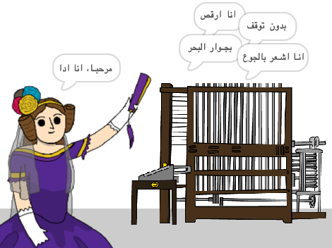

\--- no-print \---

هذا هو إصدار ** Scratch 3 ** من المشروع. هنالك أيضًا [ إصدار Scratch 2 للمشروع ](https://projects.raspberrypi.org/en/projects/poetry-generator-scratch2).

\--- /no-print \---

## المقدمة

سوف تتعلم كيفية برمجة مولّد الشِعر الخاص بك!

\--- no-print \---

  <iframe allowtransparency="true" width="485" height="402" src="https://scratch.mit.edu/projects/embed/77844926/?autostart=false" frameborder="0" scrolling="no"></iframe>
  

\--- /no-print \---

\--- print-only \---

\--- /print-only \---

## \--- collapse \---

## title: ما الذي ستتعلمه

+ المتغيرات؛
+ القوائم وعناصر القوائم العشوائية؛
+ التكرار (كتلة `كرّر`{: class = "block3control"}).

\--- /collapse \---

## \--- collapse \---

## title: ما ستحتاج إليه

#### الأجهزة

+ جهاز كمبيوتر يدعم تشغيل برنامج Scratch 3

#### البرمجيات

+ برنامج Scratch 3 (سواء أكان [عبر الإنترنت](http://rpf.io/scratchon){:target="_blank"} أو [دون اتصال بالإنترنت](http://rpf.io/scratchoff){:target="_blank"})

#### للتحميل

برنامج البداية ستجدة [هنا ](http://rpf.io/p/en/poetry-generator-go){:target="_blank"}.

\--- /collapse \---

## \--- collapse \---

## title: معلومات إضافية للمعلمين

This project has been created to celebrate [Ada Lovelace Day](https://findingada.com). If you're a teacher, you can download a School Resource Pack containing which also contains an an assembly plan ([downloads.codeclub.org.uk/ada.zip](http://downloads.codeclub.org.uk/ada.zip)), to introduce children to Ada and her revolutionary ideas.

\--- no-print \---

If you need to print this project, please use the [printer-friendly version](https://projects.raspberrypi.org/en/projects/poetry-generator/print){:target="_blank"}.

\--- /no-print \---

You can find the [completed project here](http://rpf.io/p/en/poetry-generator-get){:target="_blank"}.

\--- /collapse \---