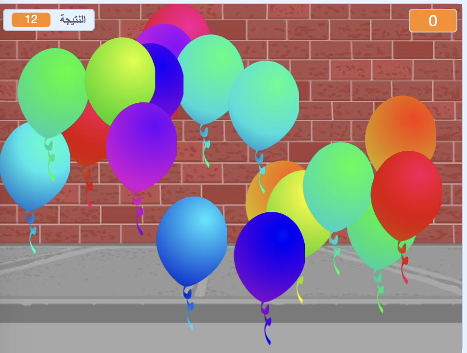

## ما التالي؟

ألق نظرة على مشروع [البالونات](https://projects.raspberrypi.org/en/projects/balloons) في برنامج Scratch.

\--- no-print \---

فرقع البالونات بالضغط عليها.

  <iframe allowtransparency="true" width="485" height="402" src="https://scratch.mit.edu/projects/embed/299206746/?autostart=false" frameborder="0" scrolling="no"></iframe>
  

\--- /no-print \---

\--- print-only \---

\--- /print-only \---