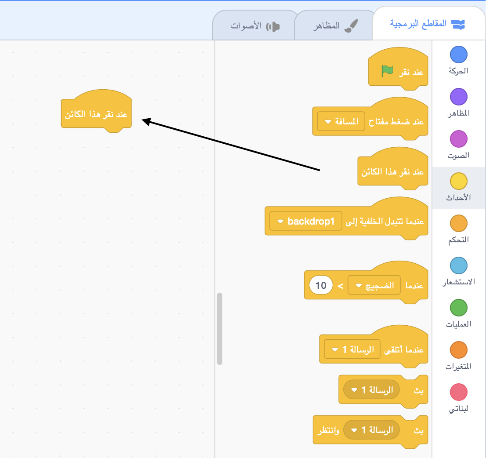
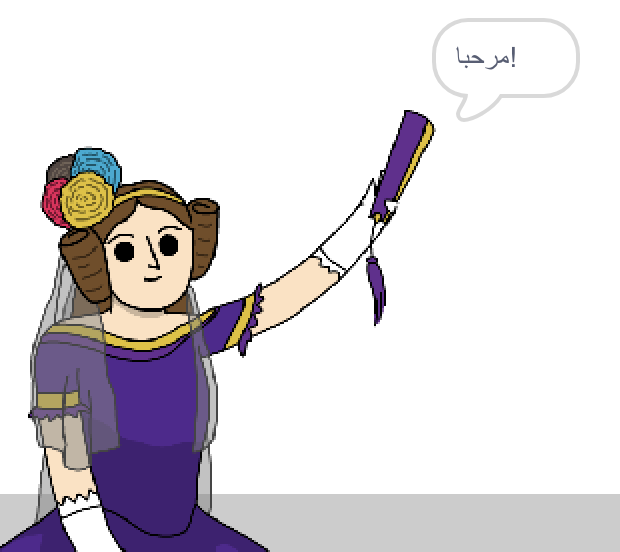

## ادا لوفيلاس

في عام 1842، كتبت ادا لوفيلاس عن استخدام آلة تسمى "المحرك التحليلي" لإجراء العمليات الحسابية، وتعتبر أول مبرمجة كمبيوتر في العالم! كانت ادا أيضًا أول شخص اكتشف أن أجهزة الكمبيوتر يمكن أن تكون أكثر من مجرد حاسبات كبيرة.

\--- task \---

افتح مشروع بداية سكراتش "مولد الشعر".

**متصل بالانترنيت**: افتح مشروع البداية [scratch.mit.edu/projects/382656129](https://scratch.mit.edu/projects/382656129){:target="_blank"}.

اذا كنت تملك حساب على منصة السكراتش (Scratch) فيمكنك عمل نسخة بالضغط على **Remix**.

**دون اتصال بالانترنت**: افتح [المشروع المبدئي](https://rpf.io/p/ar-SA/poetry-generator-go){:target="_blank"} عبر المحرر الموجود على جهازك.

اذا كنت تحتاج الى تنزيل وتنصيب برنامج السكراتش Scratch على جهازك الشخصي، ستجده في [rpf.io/scratchoff](https://rpf.io/scratchoff){:target="_blank"}.

\--- /task \---

\--- task \---

انقر على شخصية "ادا" ، وانقر على علامة التبويب `الأحداث`{: class = "block3events"} في قسم "المقاطع البرمجية". اسحب كتلة `عند النقر على هذا الكائن {`: class = "block3events"} الى منطقة الترميز على اليمين.




سيتم تشغيل أي رمز يضاف أسفل هذا الكتلة عند النقر فوق ادا!

\--- /task \---

\--- task \---

انقر على علامة تبويب `المظاهر`{: class = "block3looks"} ، واسحب كتلة `قل`{: class = "block3looks"} `مرحبًا!` `لمدة ثانيتين`{: class = "block3looks"} وضعها أسفل `عند النقر على هذا الكائن`{: class = "block3events"} الذي قمت بإضافته بالفعل.


```blocks3
when this sprite clicked
say [Hello!] for (2) seconds
```

\--- /task \---

\--- task \---

انقر على ادا، ويجب أن تراها تتحدث إليك.



\--- /task \---