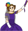
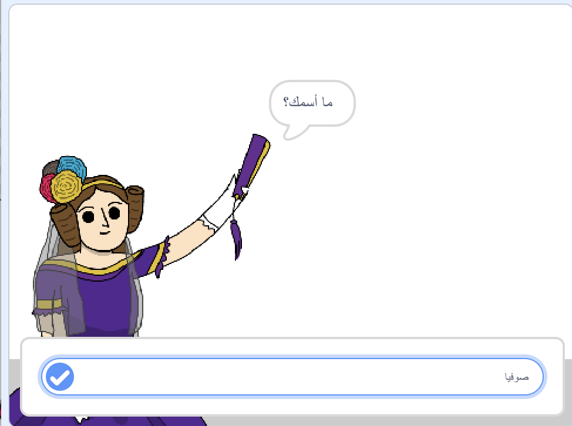
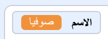
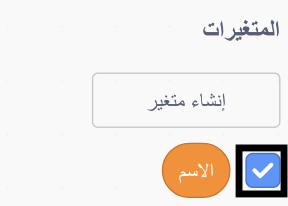
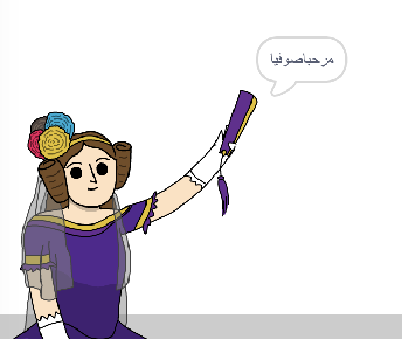

## إخبار آدا بأسمك

قدمت ادا نفسها، لكنها لا تعرف اسمك!

\--- task \---

اسحب كتلة `اسأل`{: class = "block3sensing"} (من قسم التحسس ``{: class = "block3sensing"}) إلى الكود الخاص بك. هذا ما ينبغي ان تبدو عليه تعليماتك البرمجية:



```blocks3
when this sprite clicked
say [Hi, I'm Ada!] for (2) seconds
+ ask [What's your name?] and wait
```

\--- /task \---

\--- task \---

انقر على ادا لأختبار الكود البرمجي الخاص بك. يجب أن تسألك ادا عن اسمك، والذي يمكنك كتابته!



\--- /task \---

\--- task \---

يمكننا استخدام **متغير** لتخزين اسمك. انقر فوق `المتغيرات`{: class = "block3variables"} ، ثم "إنشاء متغير". نظرًا لأنه سوف يتم استخدام هذا المتغير لتخزين اسمك، فلندعو المتغير... `name`{:class="block3variables"}!

[[[generic-scratch3-add-variable]]]

\--- /task \---

\--- task \---

لتخزين اسمك، انقر فوق علامة التبويب `المتغيرات`{: class = "block3variables"} ، ثم اسحب كتلة `إجعل الاسم مساوياً`: {= class = "block3variables"} إلى نهاية الكود البرمجي الخاص بك.


```blocks3
when this sprite clicked
say [Hi, I'm Ada!] for (2) seconds
ask [What's your name?] and wait
+ set [name v] to [0]
```

\--- /task \---

\--- task \---

استخدم كتلة `الإجابة`{: class = "block3sensing"} لتخزين الإجابة التي تكتبها.


```blocks3
when this sprite clicked
say [Hi, I'm Ada!] for (2) seconds
ask [What's your name?] and wait
set [name v] to (answer :: +)
```

\--- /task \---

\--- task \---

أنقر على ادا لأختبار الكود البرمجي الخاص بك، وأدخل اسمك عندما يُطلب منك ذلك. يجب أن ترى أن اسمك قد تم تخزينه في متغير الاسم `{`: class = "block3variables"}.



\--- /task \---

\--- task \---

يمكنك الآن الاستفادة من اسمك في التعليمات البرمجية الخاصة بك. Add this code:


```blocks3
when this sprite clicked
say [Hi, I'm Ada!] for (2) seconds
ask [What's your name?] and wait
set [name v] to (answer)
+say (join [Hi ] (name)) for (2) seconds 
```

To create this code:

1. Drag a `join`{:class="blockoperators"} block onto the `say`{:class="blocklooks"} block
    
    ```blocks3
    say (join [apple] [banana] :: +) for (2) seconds
    ```

2. Add your `name`{:class="blockdata"} block onto the `join`{:class="blockoperators"} block.
    
    ```blocks3
    say (join [Hi] (name :: variables +)) for (2) seconds
    ```

\--- /task \---

\--- task \---

To hide your `name`{:class="block3variables"} variable on the stage, click the tick next to the variable.



\--- /task \---

\--- task \---

Test your new code. Ada should say hello to you, using your name!



If there's no space between the word 'Hi' and your name, you'll need to add a space into the code yourself!

\--- /task \---

\--- task \---

Finally, add this code to explain what to do next:


```blocks3
when this sprite clicked
say [Hi, I'm Ada!] for (2) seconds
ask [What's your name?] and wait
set [name v] to (answer)
say (join [Hi ] (name)) for (2) seconds 
+ say [Click the computer to generate a poem.] for (2) seconds 
```

\--- /task \---

\--- task \---

Test Ada's code one last time, to make sure that everything works.

\--- /task \---