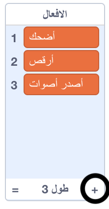
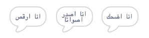

## المحرك التحليلي

دعنا نبرمج كمبيوتر ادا (يسمى "المحرك التحليلي") لتوليد الشعر.

--- task ---

أضف هذا الكود البرمجي إلى "الكمبيوتر" الخاص بك، ليتحدث عند النقر عليه:


```blocks3
when this sprite clicked
say [هذه هي قصيدتك…] for (2) seconds
```

--- /task ---

--- task ---

لإنشاء قصيدة عشوائية، أولاً يجب عليك ان تحصل على **لائحة** من الكلمات لأستخدامها. لإنشاء قائمة جديدة، انقر فوق علامة التبويب `المتغيرات`{:class="block3variables"}.

دعونا نستخدم **أفعال** (افعال الحركة) في السطر الأول من قصيدتك. أنشئ قائمة جديدة تسمى `أفعال`{:class="block3variables"}.

[[[generic-scratch3-make-list]]]

--- /task ---

--- task ---

ستكون قائمتك الجديدة فارغة. انقر فوق `+` أسفل القائمة الفارغة وأضف هذه الأفعال:



--- /task ---

--- task ---

يجب أن يكون السطر الأول من قصيدتك الكلمة "أنا" ، متبع بفعل عشوائي.

لإنشاء هذا السطر من الشعر، سوف تحتاج إلى:

1. `اختر رقمًا عشوائيًا`{:class="block3operators"} بين `1` و `طول قائمة الأفعال`{:class="block3variables"}:
    
    ```blocks3
    (pick random (1) to (length of [الأفعال v]))
    ```

2. استخدام هذه الكتلة للحصول على عنصر `عشوائي`{:class="block3variables"} من `الأفعال`{:class= "block3variables"} القائمة:
    
    ```blocks3
    (item (pick random (1) to (length of [الأفعال v]) :: +) of [الأفعال v])
    ```

3. `اربط`{:class="block3operators"} "أنا" مع فعل عشوائي لإنشاء السطر الأول من قصيدتك:
    
    ```blocks3
    (join [أنا ] (item (pick random (1) to (length of [الأفعال v])) of [الأفعال v] :: +))
    ```

4. استخدم كتلة `قل`{:class="block3looks"} لعرض سطر الشعر:
    
    ```blocks3
    say (join [أنا ](item (pick random (1) to (length of [الأفعال v])) of [الأفعال v]) :: +) for (2) seconds
    ```

يجب أن تبدو التعليمات البرمجية الخاصة بك بالشكل التالي:


```blocks3
when this sprite clicked
say [هذه هي قصيدتك…] for (2) seconds
+ say (join [أنا ](item (pick random (1) to (length of [الأفعال v])) of [الأفعال v])) for (2) seconds
```

--- /task ---

--- task ---

اختبر الكود البرمجي الخاص بك عدة مرات. يجب أن يختار جهاز الكمبيوتر كلمة عشوائية من قائمة الأفعال في كل مرة.



--- /task ---