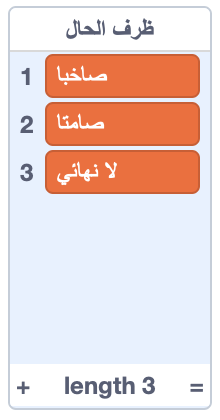
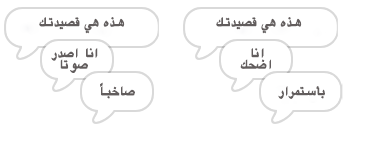
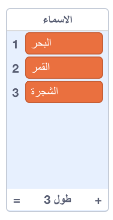
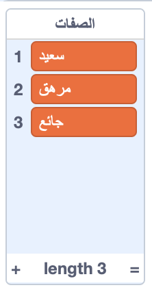
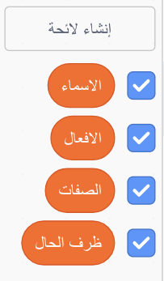

## المزيد من الشعر

قصيدتك قصيرة جدًا - دعنا نضيف إليها!

--- task ---

دعونا نستخدم ظروف الحال في السطر التالي من قصيدتك. **الحال** هي كلمة تصف الفعل. أنشئ قائمة أخرى تسمى الظروف الحال، وأضف هذه الكلمات الثلاث:



--- /task ---

--- task ---

أضف هذا السطر إلى الكود البرمجي الخاص بجهاز الكمبيوتر، لقول ظرف حال عشوائي في السطر التالي من قصيدتك:


```blocks3
when this sprite clicked
say [هذه هي قصيدتك…] for (2) seconds
say (join [أنا ](item (pick random (1) to (length of [الأفعال v])) of [الأفعال v])) for (2) seconds
+say (item (pick random (1) to (length of [ظرف الحال v])) of [ظرف الحال v]) for (2) seconds
```

--- /task ---

--- task ---

اختبر الكود البرمجي الخاص بك عدة مرات. يجب أن ترى قصيدة عشوائية في كل مرة.



--- /task ---

--- task ---

أضف قائمة الأسماء إلى مشروعك. **الاسم** هو مكان أو شيء.



--- /task ---

--- task ---

أضف الكود البرمجي لاستخدام الأسماء في قصيدتك.


```blocks3
when this sprite clicked
say [هذه هي قصيدتك…] for (2) seconds
say (join [أنا ](item (pick random (1) to (length of [الأفعال v])) of [الأفعال v])) for (2) seconds
say (item (pick random (1) to (length of [ظرف الحال v])) of [ظرف الحال v]) for (2) seconds
+say (join [بواسطة ](item (pick random (1) to (length of [الأسماء v])) of [الأسماء v])) for (2) seconds
```

--- /task ---

--- task ---

أضف قائمة الصفات إلى مشروعك. و **صفة** هي كلمة تصف الامور والاشخاص.



--- /task ---

--- task ---

أضف الكود البرمجي لاستخدام الصفات في قصيدتك:


```blocks3
when this sprite clicked
say [هذه هي قصيدتك…] for (2) seconds
say (join [أنا ](item (pick random (1) to (length of [الأفعال v])) of [الأفعال v])) for (2) seconds
say (item (pick random (1) to (length of [ظرف الحال v])) of [ظرف الحال v]) for (2) seconds
say (join [بواسطة ](item (pick random (1) to (length of [الأسماء v])) of [الأسماء v])) for (2) seconds
+ say (join [انا أشعر ](item (pick random (1) to (length of [الصفات v])) of [الصفات v])) for (2) seconds
```

--- /task ---

--- task ---

يمكنك النقر على المربعات بجوار قوائمك لإخفائها.



--- /task ---

--- task ---

اختبر قصيدتك الجديدة.

--- /task ---