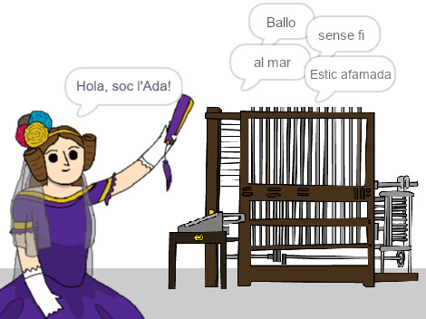

\--- no-print \---

Es tracta de la versió ** Scratch 3 **del projecte. També hi ha una [ versió de Scratch 2 del projecte ](https://projects.raspberrypi.org/en/projects/poetry-generator-scratch2).

\--- / no-print \---

## Introducció

Aprendràs a programar el teu propi generador de poesia!

\--- no-print \---

  <iframe allowtransparency="true" width="485" height="402" src="https://scratch.mit.edu/projects/embed/77844926/?autostart=false" frameborder="0" scrolling="no"></iframe>
  

\--- / no-print \---

\--- només imprimir \---

\--- / print-only \---

## \--- collapse \---

## títol: Què aprendràs

+ Les variables;
+ Llistes i elements de la llista aleatoris;
+ Repetició (el bloc `repetir`{:class="blockcontrol"}).

\--- / collapse \---

## \--- collapse \---

## títol: Què necessitaràs

#### Maquinari

+ Un ordinador capaç d'executar Scratch 3

#### Programari

+ Scratch 3 (ja sigui [en línia](http://rpf.io/scratchon){:target="_ blank"} o [fora de línia](http://rpf.io/scratchoff){:target="_ blank"})

#### Descàrregues

El projecte inicial es pot trobar [aquí](http://rpf.io/p/en/poetry-generator-go){:target="_ blank"}.

\--- / collapse \---

## \--- collapse \---

## títol: Informació addicional per educadors

Aquest projecte ha estat creat per celebrar el [Dia de l'Ada Lovelace](https://findingada.com). Si sou un professor, podeu descarregar un paquet de recursos escolars que conté un pla de muntatge ([downloads.codeclub.org.uk/ada.zip](http://downloads.codeclub.org.uk/ada.zip)) per presentar l'Ada i les seves idees revolucionàries als alumnes.

\--- no-print \---

Si necessites imprimir aquest projecte, si us plau, utilitza la [versió per imprimir](https://projects.raspberrypi.org/en/projects/poetry-generator/print){:target="_blank"}.

\--- / no-print \---

Pots trobar el [projecte acabat aquí](http://rpf.io/p/en/poetry-generator-get){:target="_blank"}.

\--- / collapse \---