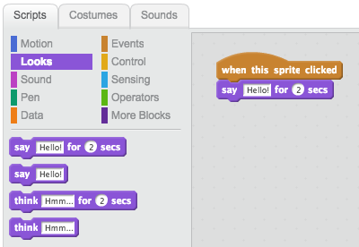

## Ada Lovelace

El 1842, Ada Lovelace va escriure sobre l'ús d'una màquina anomenada 'Motor Analític' per fer càlculs, i es considera el primer programador informàtic del món. Ada també va ser el primer en veure que les computadores podrien ser més que grans calculadores.

+ Obriu el projecte Scratch 'Poetry Generator' en línia a <a href="http://jumpto.cc/poetry-go" target="_blank">jumpto.cc/poetry-go</a> o descarregueu des de <a href="http://jumpto.cc/poetry-get" target="_blank">jumpto.cc/poetry-get</a> i obriu-lo si utilitzeu l'editor fora de línia.

+ Feu clic al sprite 'Ada' i feu clic a la pestanya `Esdeveniments`{: class = "blockevents"} a la secció de codificació "Scripts". Arrossegueu el `quan aquest sprite faci clic a`{: class = "blockevents"} bloqueig a l'àrea de codificació de la dreta.

Qualsevol codi agregat sota aquest bloc s'executarà quan es fa clic a Ada!

+ Feu clic a la pestanya `visualitzacions`{: class = "blocklooks"} i arrossegueu `dir`{: class = "blocklooks"} `Hola!` `per 2 segons`{: class = "blocklooks"} bloca per sota del codi que ja heu afegit.

+ Feu clic a Ada i hauríeu de veure la vostra xerrada.

