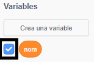

## Digues-li el teu nom a l'Ada

L'Ada s'ha presentat, però ella no sap el teu nom!

\--- task \---

Arrossega un bloc `pregunta`{:class="block3sensing"} (de la secció `sensors`{:class="block3sensing"}) al teu codi. Així és com s'hauria de veure el teu codi:


```blocks3
when this sprite clicked
say [Hi, I'm Ada!] for (2) seconds
+ ask [What's your name?] and wait
```

\--- /task \---

\--- task \---

Fes clic a l'Ada per provar el teu codi. L'Ada t'hauria de demanar el teu nom, que pots escriure!


\--- /task \---

\--- task \---

Podem utilitzar una **variable** per emmagatzemar el teu nom. Fes clic a `Variables`{: class = "blockdata"} i, a continuació, "Crea una variable". Com que aquesta variable s'utilitzarà per emmagatzemar el vostre nom, anomenem la variable... `nom`{:class="block3variables"}!

[[[generic-scratch3-add-variable]]]

\--- /task \---

\--- task \---

Per emmagatzemar el teu nom, fes clic a la pestanya `Variables`{:class="block3variables"}, i arrossega el bloc `assigna a`{:class="block3variables"} al final del teu codi.


```blocks3
when this sprite clicked
say [Hi, I'm Ada!] for (2) seconds
ask [What's your name?] and wait
+ set [name v] to [0]
```

\--- /task \---

\--- task \---

Empra el bloc `resposta`{:class="block3sensing"} per emmagatzemar la resposta que has escrit.


```blocks3
when this sprite clicked
say [Hi, I'm Ada!] for (2) seconds
ask [What's your name?] and wait
set [name v] to (answer :: +)
```

\--- /task \---

\--- task \---

Fes clic a l'Ada per provar el teu codi i introdueix el teu nom quan se't demani. Hauries de veure que el teu nom ha estat emmagatzemat a la variable `nom`{:class="block3variables"}.


\--- /task \---

\--- task \---

Ara ja pots fer ús del del teu nom en el teu codi. Afegeix aquest codi:


```blocks3
when this sprite clicked
say [Hi, I'm Ada!] for (2) seconds
ask [What's your name?] and wait
set [name v] to (answer)
+say (join [Hi ] (name)) for (2) seconds 
```

Per crear aquest codi:

1. Arrossega el bloc `uneix`{:class="blockoperators"} dins el bloc `digues`{:class="blocklooks"}
    
    ```blocks3
    say (join [apple] [banana] :: +) for (2) seconds
    ```

2. Afegeix el bloc `nom`{:class="blockdata"} dins el bloc `uneix`{:class="blockoperators"}.
    
    ```blocks3
    say (join [Hi] (name :: variables +)) for (2) seconds
    ```

\--- /task \---

\--- task \---

Per amagar la variable `nom`{:class="block3variables"} de l'escenari, fes clic a la casella que hi ha al costat de la variable.



\--- /task \---

\--- task \---

Prova el codi nou. L'Ada hauria de saludar-te amb el teu nom!


Si no hi ha espai entre la paraula "Hola" i el teu nom, hauràs d'afegir un espai al codi!

\--- /task \---

\--- task \---

Finalment, afegeix aquest codi per explicar què fer a continuació:


```blocks3
when this sprite clicked
say [Hi, I'm Ada!] for (2) seconds
ask [What's your name?] and wait
set [name v] to (answer)
say (join [Hi ] (name)) for (2) seconds 
+ say [Click the computer to generate a poem.] for (2) seconds 
```

\--- /task \---

\--- task \---

Prova el codi de l'Ada per última vegada, per assegurar-te que tot funciona.

\--- /task \---