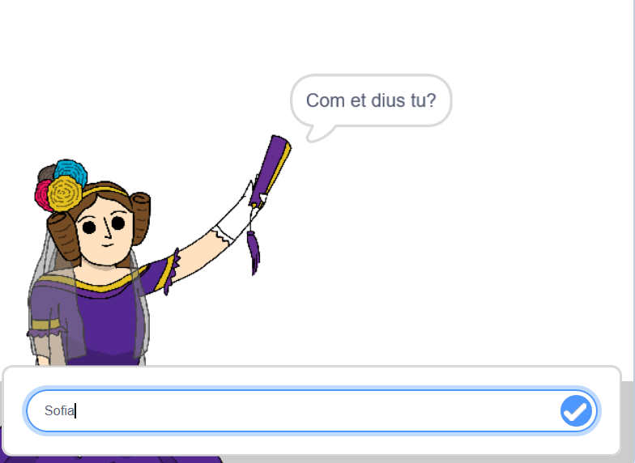
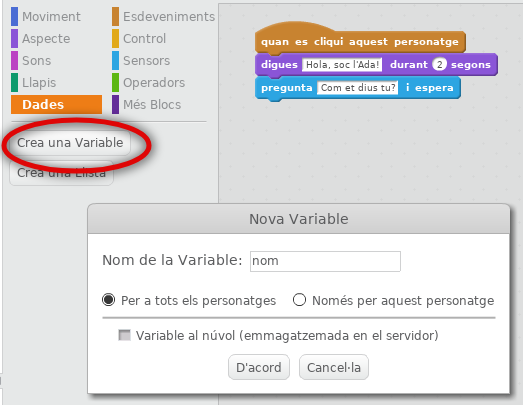
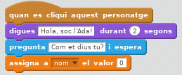
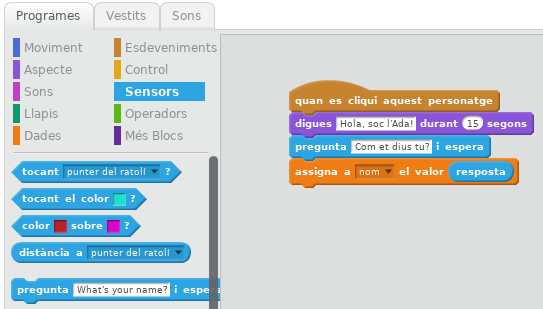
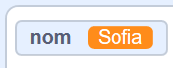
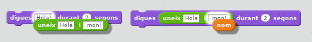
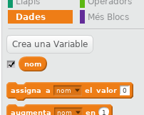
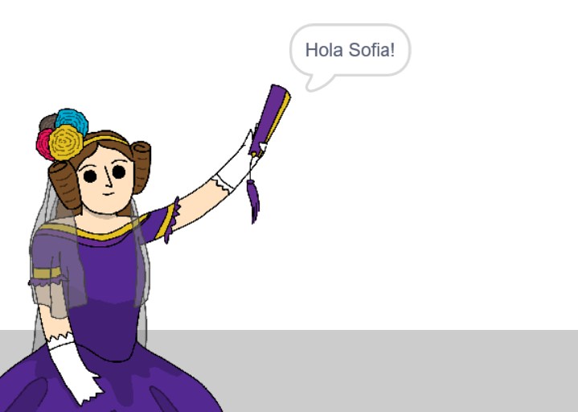

## Digueu-li a l'Ada el vostre nom

Ada s'ha presentat, però no sap el teu nom!

+ Arrossegant un `pregunta`{:class="blocksensing"} bloc (des del `Sensors`{:class="blocksensing"} secció) en el seu codi. A continuació s'explica com hauria d'aparèixer el vostre codi:

```blocks
quan es cliqui aquest personatge 
digues [Hola, soc l'Ada!] durant (2) segons 
pregunta [Com et dius tu?] i espera
```

+ Feu clic a l'Ada per provar el vostre codi. L'Ada hauria de demanar el vostre nom, que podeu escriure!



+ Podem utilitzar una **variable d'** a emmagatzemar el seu nom. Feu clic a `Dades`{:class="blockdata"} i, a continuació, "Crea una variable". Com que aquesta variable s'utilitzarà per emmagatzemar el vostre nom, anomenem la variable... `nom`{:class="blockdata"}!



+ Per emmagatzemar el seu nom, feu clic al `Dades`{:class="blockdata"} pestanya, i després arrossegar el `assigna a`{:class="blockdata"} bloquejar a l'extrem del seu codi.



+ Utilitzeu el `resposta`{:class="blocksensing"} de bloc per emmagatzemar la resposta s'escriu en.



+ Feu clic a l'Ada per provar el vostre codi i introduïu el vostre nom quan se us demani. Hauria de veure que el seu nom ha estat emmagatzemat al `Nom`{:class="blockdata"} variable.



+ Ara podeu fer ús del vostre nom al vostre codi. Afegiu aquest codi:

```blocks
digues (uneix [Hola] i (nom))
```

Per crear aquest codi, primer arrossegueu un `uneix`{:class="blockoperators"} bloqueja el bloc `digues`{:class="blocklooks"} i, a continuació, afegiu el vostre `nom`{:class="blockdata"} bloquejar a la `uneix`(:class="blockoperators"} bloc.



+ Per ocultar la seva `Nom`{:class="blockdata"} variable sobre l'escenari, feu clic a la marca al costat de la variable.



+ Proveu el codi nou. Ada hauria de saludar-vos amb el vostre nom!



Si no hi ha espai entre la paraula "Hola" i el vostre nom, haureu d'afegir-hi un espai al codi.

+ Finalment, afegiu aquest codi per explicar què fer següent:

```blocks
digues [Feu clic a l'ordinador per generar un poema!] durant (2) segons
```

+ Prova el codi d'Ada per última vegada, per assegurar-te que tot funciona. A continuació us indiquem com hauria de veure el vostre codi:

```blocks
quan es cliqui aquest personatge
digues [Hola, sóc l'Ada!] durant (2) segons
pregunta [Quin és el vostre nom?] i espera
assigna a [nom v] el valor (resposta) 
digues (uneix [Hola] i (nom)) durant (2) segons
digues [Feu clic a l'ordinador per generar un poema!] durant (2) segons
```
