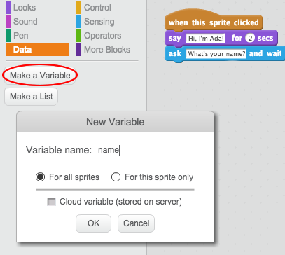
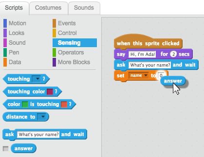
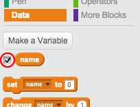

## Digues-li el teu nom a l'Ada

L'Ada s'ha presentat, però ella no sap el teu nom!

+ Arrossega un `pregunta`{: class = "blocksensing"} bloc (des del `Sensors`{: class = "blocksensing"} secció) al teu codi. A continuació s'explica com hauria de veure's el teu codi:

```blocks
quan es cliqui aquest personatge 
digues: [Hola, sóc l'Ada!] durant (2) segs 
pregunta [Quin és el teu nom?] i espera
```

+ Feu clic a l'Ada per provar el vostre codi. L'Ada t'hauria de demanar el teu nom, que pots escriure!


+ Podem utilitzar una **variable** per emmagatzemar el teu nom. Fes clic a `Dades`{: class = "blockdata"} i, a continuació, "Crea una variable". Com que aquesta variable s'utilitzarà per emmagatzemar el vostre nom, anomenem la variable... `nom`{: class = "blockdata"}!



+ Per emmagatzemar el seu nom, fes clic al `Dades`{: class = "blockdata"} pestanya, i després arrossega el bloc `assigna nom`{: class = "blockdata"} a l'extrem del teu codi.


+ Utilitza el bloc `resposta`{: class = "blocksensing"} per emmagatzemar la resposta que escrius.



+ Fes clic a l'Ada per provar el teu codi i introdueix el teu nom quan s'et demani. Hauries de veure que el teu nom ha estat emmagatzemat a la variable`Nom`{: class = "blockdata"}.


+ Ara ja pots fer ús del del teu nom en el teu codi. Afegeix aquest codi:

```blocks
digues (join [Hola](nom))
```

Per crear aquest codi, primer arrossega un bloc `uneix-te`{: class = "blockoperators"} al bloc`digues`{: class = "blocklooks"} i, a continuació, afegeix el teu bloc `nom`{: class = "blockdata"} sobre el bloc `uneix-te`(: class = "blockoperators"}.


+ Per ocultar la teva variable `Nom`{: class = "blockdata"} a l'escenari, fes clic a la casella del costat de la variable.



+ Prova el codi nou. L'Ada hauria de saludar-te amb el teu nom!


Si no hi ha espai entre la paraula "Hola" i el teu nom, hauràs d'afegir-hi un espai al codi!

+ Finalment, afegeix aquest codi per explicar què fer a continuació:

```blocks
digues [Fes clic a l'ordinador per generar un poema!] durant (2) segons
```

+ Prova el codi de l'Ada per última vegada, per assegurar-te que tot funciona. Així és com s'hauria de veure el teu codi:

```blocks
quan es cliqui aquest personatge
digues [Hi, sóc l'Ada!] durant (2) secs 
pregunta [Quin és el teu nom?] i espera
assigna a [nom v] el valor (resposta) 
digues (uneix [Hola ] (nom)) durant (2) secs
digues [Feu clic a l'ordinador per generar un poema.] durant (2) secs 
```