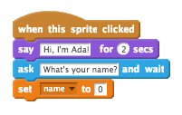
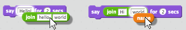

## Digueu a Ada el vostre nom

Ada s'ha presentat, però no sap el teu nom!

+ Arrossegant un `pregunten`{: class = "blocksensing"} bloc (des del `de detecció de`{: class = "blocksensing"} secció) en el seu codi. A continuació s'explica com hauria d'aparèixer el vostre codi:

```blocks
quan aquest sprite fa clic fa clic a: [Hola, sóc Ada!] per (2) segs preguntar [Quin és el vostre nom?] i esperar
```

+ Feu clic a Ada per provar el vostre codi. Ada hauria de demanar el vostre nom, que podeu escriure!


+ Podem utilitzar un **variable d'** a emmagatzemar el seu nom. Feu clic a `Dades`{: class = "blockdata"} i, a continuació, "Fes una variable". Com que aquesta variable s'utilitzarà per emmagatzemar el vostre nom, truquem a la variable ... `nom`{: class = "blockdata"}!


+ Per emmagatzemar el seu nom, feu clic al `Dades`{: class = "blockdata"} pestanya, i després arrossegar el `nom del conjunt`{: class = "blockdata"} bloquejar a l'extrem del seu codi.



+ Utilitzeu el `respostes`{: class = "blocksensing"} de bloc per emmagatzemar la resposta s'escriu en.


+ Feu clic a Ada per provar el vostre codi i introduïu el vostre nom quan se us demani. Hauria de veure que el seu nom ha estat emmagatzemat al `Nom`{: class = "blockdata"} variable.


+ Ara podeu fer ús del vostre nom al vostre codi. Afegiu aquest codi:

```blocks
digues (uniu-vos-hi) (nom)
```

Per crear aquest codi, primer arrossegueu un `uniu-vos`{: class = "blockoperators"} bloqueja el bloc `diu`{: class = "blocklooks"} i, a continuació, afegiu el vostre `nom`{: class = "blockdata"} bloquejar a la `uneix-te`(: class = "blockoperators"} bloc.



+ Per ocultar la seva `Nom`{: class = "blockdata"} variable sobre l'escenari, feu clic a la marca al costat de la variable.


+ Proveu el codi nou. Ada hauria de saludar, usant el vostre nom!


Si no hi ha espai entre la paraula "Hola" i el vostre nom, haureu d'afegir-hi un espai al codi.

+ Finalment, afegiu aquest codi per explicar què fer següent:

```blocks
digues [Feu clic a l'ordinador per generar un poema!] per a (2) segons
```

+ Prova el codi d'Ada per última vegada, per assegurar-te que tot funciona. A continuació us indiquem com hauria de veure el vostre codi:

```blocks
quan aquest sprite va fer clic a [Hi, sóc Ada!] per (2) segs preguntareu [Quin és el vostre nom?] i espereu que estableixi [nom v] a (respongui) dir (uniu-vos-hi (nom)) per (2 ) Diuen [Feu clic a l'ordinador per generar un poema.] per a (2) segons 
```