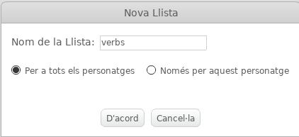
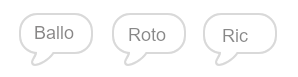

## El motor analític

Anem a programar l'ordinador d'Ada (anomenat 'motor analític') per generar poesia.

+ Afegiu aquest codi al vostre personatge "Ordinador", perquè parli quan feu clic a:

```blocks
quan es cliqui aquest personatge
digues [Aquí està el vostre poema ...] durant (2) segons
```

+ Per crear un poema a l'atzar, primer es necessita un **llista** de paraules a utilitzar. Per crear una nova llista, feu clic a la pestanya `Dades`{:class="blockdata"}.

Anem a utilitzar **verbs** (paraules d'acció) a la primera línia del vostre poema. Creeu una nova llista anomenada "verbs".



+ La vostra nova llista estarà buida. Feu clic al `+` al final de la llista buida i afegiu aquests verbs:


+ La primera línia del vostre poema serà la paraula "jo", seguit d'un verb aleatori. Aquest és el codi que haureu d'afegir:

```blocks
quan es cliqui aquest personatge
digues [Aquí està el vostre poema ...] durant (2) segons 
digues (uneix [Jo] i (element (aleatori v) de [verbs v] :: list)) durant (2) segons
```

+ Proveu el codi diverses vegades. L'equip ha de dir una paraula aleatòria de la vostra llista de verbs cada vegada.


