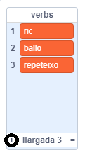

## El motor analític

Anem a programar l'ordinador de l'Ada (anomenat 'motor analític') per generar poesia.

\--- task \---

Afegeix aquest codi al teu personatge "Ordinador", perquè parli quan el cliquis:


```blocks3
when this sprite clicked
say [Here is your poem...] for (2) seconds
```

\--- /task \---

\--- task \---

Per crear un poema a l'atzar, primer es necessita una **llista** de paraules. To create a new list, click the `Variables`{:class="block3variables"} tab.

Ara utilitzarem **verbs** (paraules d'acció) a la primera línia del teu poema. Crea una llista nova que es digui `verbs`{:class="block3variables"}.

[[[generic-scratch3-make-list]]]

\--- /task \---

\--- task \---

La teva llista nova estarà buida. Fes clic al `+` al final de la llista buida i afegeix aquests verbs:



\--- /task \---

\--- task \---

La primera línia del teu poema hauria de ser la paraula "Jo", seguida d'un verb aleatori.

Per crear aquesta línia de poesia, cal:

1. `Nombre a l'atzar`{:class="block3operators"} entre `1` i la `longitud de la llista de verbs`{:class="block3variables"}:
    
    ```blocks3
    (pick random (1) to (length of [verbs v]))
    ```

2. Utilitza aquest bloc per obtenir un `element`{:class="block3variables"} aleatori de la llista dels `verbs`{:class="block3variables"}:
    
    ```blocks3
    (item (pick random (1) to (length of [verbs v]) :: +) of [verbs v])
    ```

3. `Uneix`{:class="block3operators"} "Jo" amb el verb a l'atzar per crear la primera línia del teu poema:
    
    ```blocks3
    (join [I ] (item (pick random (1) to (length of [verbs v])) of [verbs v] :: +))
    ```

4. Fes servir un bloc `digues`{:class="block3looks"} per mostrar la línia de poesia:
    
    ```blocks3
    say (join [I ](item (pick random (1) to (length of [verbs v])) of [verbs v]) :: +) for (2) seconds
    ```

El teu codi hauria de ser així:


```blocks3
quan es cliqui aquest personatge
digues [Aquí tens el teu poema...] durant (2) segons
+ digues (uneix [Jo ](element (nombre a l'atzar entre (1) i (llargada de [verbs v])) de [verbs v])) durant (2) segons
```

\--- /task \---

\--- task \---

Prova el codi diverses vegades. L’ordinador hauria de triar una paraula aleatòria de la llista de `verbs`{:class="block3variables"} cada vegada.


\--- /task \---