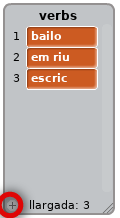

## El motor analític

Anem a programar l'ordinador de l'Ada (anomenat 'motor analític') per generar poesia.

+ Afegeix aquest codi al teu personatge "Ordinador", perquè parli quan el cliquis:

```blocks
quan es cliqui aquest personatge
digues [Aquí tens el teu poema...] durant (2) secs
```

+ Per crear un poema a l'atzar, primer es necessita una**llista** de paraules per utilitzar. Per crear una nova llista, fes clic a la pestanya `Dades`{: class = "blockdata"}.

Ara utilitzarem **verbs** (paraules d'acció) a la primera línia del teu poema. Crea una nova llista anomenada "verbs".


+ La teva nova llista estarà buida. Fes clic al `+` al final de la llista buida i afegeix aquests verbs:



+ La primera línia del teu poema serà la paraula "jo", seguit d'un verb aleatori. Aquest és el codi que haureu d'afegir:

```blocks
quan es cliqui aquest personatge
digues [Aquí tens el teu poema ...] durant (2) secs 
digues (uneix [I] (element (aleatori v) de [verbs v])) durant (2) secs
```

+ Prova el codi diverses vegades. L'ordinador hauria de dir una paraula aleatoria de la teva llista de verbs cada vegada.

