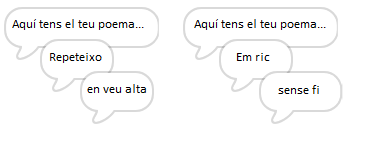
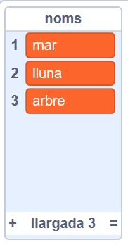
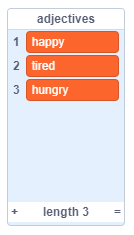
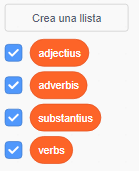

## Més poesia

El teu poema és bastant curt: afegim més text!

+ Anem a utilitzar adverbis a la següent línia del vostre poema. Un **adverbi** és una paraula que descriu un verb. Creeu una altra llista anomenada adverbis i afegiu aquestes 3 paraules:


+ Afegiu aquesta línia al codi de l'ordinador, per dir un adverbi a l'atzar a la següent línia del vostre poema:

```blocks
digues (element (aleatori v) de [adverbs v] :: list) durant (2) segons
```

+ Proveu el codi diverses vegades. Hauríeu de veure un poema aleatori cada vegada.



+ Afegiu una llista de substantius al vostre projecte. Un **substantius** és un lloc o una cosa.



+ Afegiu codi per utilitzar els substantius del vostre poema.

```blocks
digues (uneix [amb la] i (element (aleatori v) de [nouns v] :: list)) durant (2) segons
```

+ Afegiu una llista d'adjectius al vostre projecte. Un **adjectiu** és una paraula que descriu.



+ Afegiu codi per utilitzar els adjectius del vostre poema:

```blocks
digues (uneix [em trobo] i (element (aleatori v) de [adjectives v] :: list)) durant (2) segons
```

+ Podeu fer clic a les caselles que hi ha al costat de les vostres llistes per ocultar-les.



+ Proveu el vostre nou poema. Aquí teniu el codi que hauria de tenir:

```blocks
quan es cliqui aquest personatge
digues [Aquí està el vostre poema ...] durant (2) segons
digues (uneix [Jo] i (element (aleatori v) de [verbs v] :: list)) durant (2) segons
digues (element (aleatori v) de [adverbs v] :: list) durant (2) segons
digues (uneix [amb la] i (element (aleatori v) de [nouns v] :: list)) durant (2) segons
digues (uneix [em trobo] i (element (aleatori v) de [adjectives v] :: list)) durant (2) segons
```
