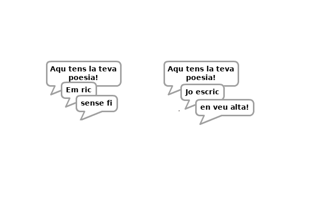
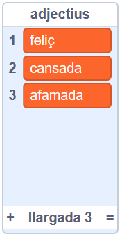

## Més poesia

El teu poema és bastant curt: afegim-ho!

+ Anem a utilitzar adverbis a la següent línia del vostre poema. Un **adverbial** és una paraula que descriu un verb. Creeu una altra llista anomenada adverbis i afegiu aquestes 3 paraules:


+ Afegiu aquesta línia al codi de l'ordinador, per dir un adverbi a l'atzar a la següent línia del vostre poema:

```blocks
diguem (element (aleatori v) de [adverbis v]) per (2) secs
```

+ Proveu el codi diverses vegades. Hauríeu de veure un poema aleatori cada vegada.



+ Afegiu una llista de noms al vostre projecte. Un **nom** és un lloc o una cosa.


+ Afegiu codi per utilitzar els substantius del vostre poema.

```blocks
dir (unir-se per l'element (aleatori v) de [substantius v])) per (2) secs
```

+ Afegiu una llista d'adjectius al vostre projecte. Un **adjectiu** és una paraula que descriu.



+ Afegiu codi per utilitzar els adjectius del vostre poema:

```blocks
dir (unir-me a [sento] (element (aleatori v) de [adjectius v])) per (2) secs
```

+ Podeu fer clic a les caselles que hi ha al costat de les vostres llistes per ocultar-les.


+ Proveu el vostre nou poema. Aquí teniu el codi que hauria de tenir:

```blocks
quan aquest sprite va fer clic a [Aquí està el vostre poema ...] per (2) segons diu (uniu-vos [I] (element (aleatori v) de [verbs v])) per (2) segons (article (aleatori v) de [adverbis v]) per (2) segons dic (uniu-ho per l'element (aleatori v) de [substantius v])) per (2) segons dic (uniu-vos-hi) (element (aleatori v) de [adjectius v])) per (2) secs
```