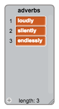

## More poetry

Your poem is quite short - let's add to it!

+ Let's use adverbs in the next line of your poem. An **adverb** is a word that describes a verb. Create another list called adverbs, and add these 3 words:



+ Add this line to your computer's code, to say a random adverb on the next line of your poem:

```blocks
say (item (random v) of [adverbs v]) for (2) secs
```

+ Test your code a few times. You should see a random poem each time.


+ Add a list of nouns to your project. A **noun** is a place or a thing.


+ Add code to use the nouns in your poem.

```blocks
say (join [by the ] (item (random v) of [nouns v])) for (2) secs
```

+ Add a list of adjectives to your project. An **adjective** is a describing word.


+ Add code to use the adjectives in your poem:

```blocks
say (join [I feel ] (item (random v) of [adjectives v])) for (2) secs
```

+ You can click the boxes next to your lists to hide them.


+ Test out your new poem. Here's the code you should have:

```blocks
when this sprite clicked
say [Here is your poem...] for (2) secs
say (join [I ] (item (random v) of [verbs v])) for (2) secs
say (item (random v) of [adverbs v]) for (2) secs
say (join [by the ] (item (random v) of [nouns v])) for (2) secs
say (join [I feel ] (item (random v) of [adjectives v])) for (2) secs
```