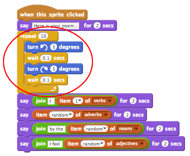
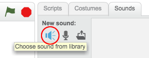

## Animació del motor analític

Ara animarem el teu ordinador, de manera que sembli que està generant poesia.

+ Fes clic al personatge de l'ordinador i afegeix aquest codi després del primer bloc `digues`{: class = "blocklooks"}:

```blocks
repeteix (10) vegades
  gira a l'esquerra (5) graus 
  espera (0.1) secs 
  gira a la dreta (5) graus 
  espera (0,1) secs 
fi
```

Així és com s'hauria de veure el teu codi:



Trobareu els blocs `repeteix`{: class = "blockcontrol"} i `espera` {: class = "blockcontrol"}a la secció `Control`{: class = "blockcontrol"}.

+ Prova el teu projecte. Hauríes de veure tremolar l'ordinador abans de crear un poema!


+ Fes clic a la pestanya "Sons" i després clica a "Selecciona so de la biblioteca".



+ Tria un so de "sonorització de l'ordinador" i fes clic a Acceptar.


+ Afegeix un bloc `toca el so`{: class = "blocksound"}, per reproduir el teu so just abans d'iniciar l'animació.

