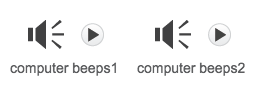

## Animació del motor analític

Anem a animar l'ordinador, de manera que sembla que està generant poesia.

+ Feu clic al sprite de l'ordinador i afegiu aquest codi després del primer `diu`{: class = "blocklooks"} bloc:

```blocks
repetir (10) girar a l'esquerra (5) graus d'espera (0.1) segons girar a la dreta (5) graus d'espera (0,1) segons final
```

A continuació s'explica com hauria d'aparèixer el vostre codi:


Trobareu el `repetició`{: class = "blockcontrol"} i `espera`blocs {: class = "blockcontrol"} estan a la secció `Control`{: class = "blockcontrol"}.

+ Proveu el vostre projecte. Hauríeu de veure la batuda de l'ordinador abans de produir un poema!


+ Feu clic a la pestanya "Sons" i feu clic a "Selecciona so de la biblioteca".


+ Trieu un so de "sonorització de l'ordinador" i feu clic a Acceptar.



+ Afegir un `joc de so`{: class = "blocksound"} bloc, per reproduir el seu so just abans d'iniciar l'animació.

