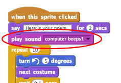

## Animació del motor analític

Anem a animar l'ordinador, de manera que sembla que està generant poesia.

+ Feu clic al personatge de l'ordinador i afegiu aquest codi després del primer `digues`{:class="blocklooks"} bloc:

```blocks
repeteix (10) vegades 
  gira a l'esquerra (5) graus
  espera (0.1) segons
  gira a la dreta (5) graus
  espera (0.1) segons
end
```

A continuació s'explica com hauria d'aparèixer el vostre codi:


Trobareu el `repeteix`{:class="blockcontrol"} i `espera`{:class="blockcontrol"} blocs estan a la secció `Control`{:class="blockcontrol"}.

+ Proveu el vostre projecte. Hauríeu de veure tremolar l'ordinador abans de produir un poema!


+ Feu clic a la pestanya "Sons" i feu clic a "Selecciona so de la biblioteca".


+ Trieu un so de "sonorització de l'ordinador" i feu clic a Acceptar.


+ Afegir un `toca el so`{:class="blocksound"} bloc, per reproduir el seu so just abans d'iniciar l'animació.


