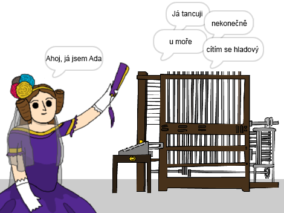

\--- no-print \---

Toto je verze **Scratch 3** projektu. K dispozici je také [verze Scratch 2 projektu](https://projects.raspberrypi.org/en/projects/poetry-generator-scratch2).

\--- /no-print \---

## Úvod

V této lekci se naučíš, jak naprogramovat svůj vlastní generátor poezie!

\--- no-print \---

  <iframe allowtransparency="true" width="485" height="402" src="https://scratch.mit.edu/projects/embed/77844926/?autostart=false" frameborder="0" scrolling="no"></iframe>
  

\--- /no-print \---

\--- print-only \---

\--- /print-only \---

## \--- collapse \---

## title: Co se naučíš

+ Proměnné;
+ Seznamy a náhodné položky seznamu;
+ Opakování (blok `opakuj`{: class = "block3control"}).

\--- /collapse \---

## \--- collapse \---

## title: Co budeš potřebovat

#### Hardware

+ Počítač schopný spustit aplikaci Scratch 3

#### Software

+ Scratch 3 (buď [online](http://rpf.io/scratchon){:target="_blank"} nebo [offline](http://rpf.io/scratchoff){:target="_blank"} verzi"})

#### Ke stažení

Startovací projekt najdete [zde](http://rpf.io/p/en/poetry-generator-go){: target = "_ blank"}.

\--- /collapse \---

## \--- collapse \---

## title: Dodatečné informace pro učitele

Tento projekt byl vytvořen k oslavě [dne Ady Lovelaceové](https://findingada.com). Pokud jste učitel, můžete si stáhnout školní zdrojový balíček, který obsahuje také plán sestavení ([downloads.codeclub.org.uk/ada.zip](http://downloads.codeclub.org.uk/ada.zip)) a představit děti Adě a jejím revolučním myšlenkám.

\--- no-print \---

Potřebujete-li tento projekt vytisknout, použijte verzi [pro-tisk](https://projects.raspberrypi.org/en/projects/poetry-generator/print){:target="_blank"}.

\--- /no-print \---

Dokončený projekt [naleznete zde](http://rpf.io/p/en/poetry-generator-get){: target = "_ blank"}.

\--- /collapse \---