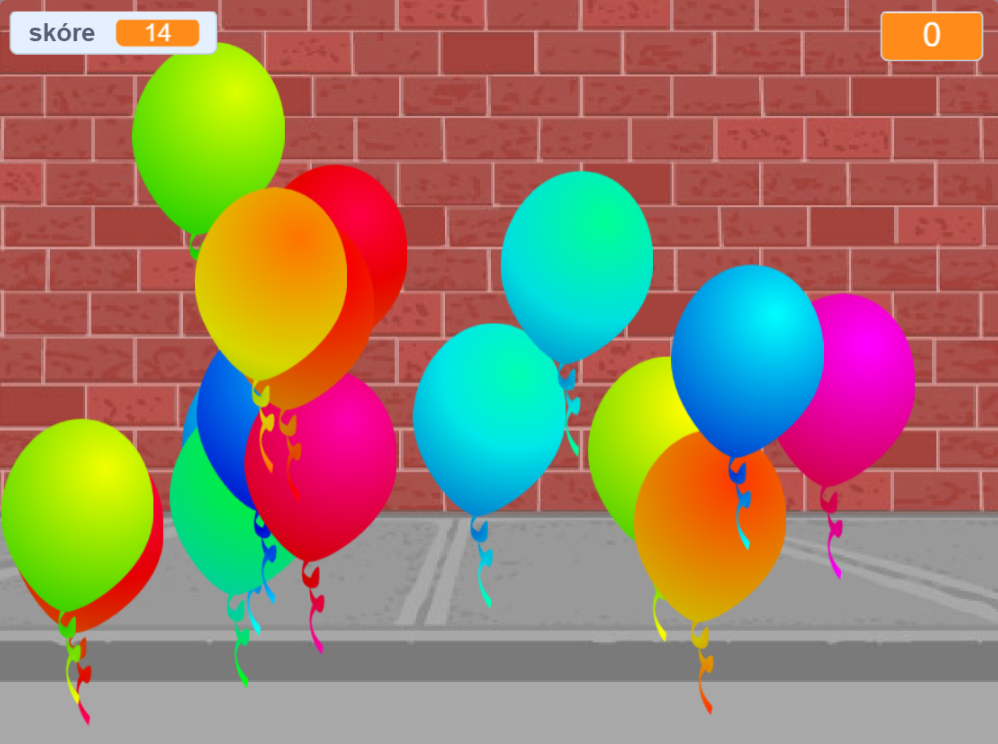

## Co dál?

Podívej se na Scratch projekt [Balónky](https://projects.raspberrypi.org/cs-CZ/projects/balloons).

--- no-print ---

Pokud klikneš na balónek, praskneš ho.

  <iframe allowtransparency="true" width="485" height="402" src="https://scratch.mit.edu/projects/embed/299206746/?autostart=false" frameborder="0" scrolling="no"></iframe>
  

--- /no-print ---

--- print-only ---

--- /print-only ---

***

Tento projekt byl přeložen dobrovolníky:

Tomáš Branda
Jiri

Díky dobrovolníkům můžeme dát lidem po celém světě šanci se učit ve svém vlastním jazyce. Můžete nám pomoci oslovit více lidí dobrovolným překládáním - více informací na [rpf.io/translate](https://rpf.io/translate).