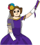

## Ada Lovelaceová

V roce 1842 psala Ada Lovelaceová o používání výpočetního stroje nazvaného „analytický stroj“ a je označována za první programátorku na světě! Ada byla také prvním člověkem, který pochopil, že počítače mohou být něco více než jenom velké kalkulačky.

\--- task \---

Otevři ve Scratchi začáteční projekt „Generátor poezie“.

**Online**: otevři [začáteční projekt](http://rpf.io/poetry-on){:target="_ blank"}.

Pokud máš Scratch účet, můžeš vytvořit kopii kliknutím na **Remix**.

**Offline**: open the [starter project](http://rpf.io/p/en/poetry-generator-go){:target="_blank"} in the offline editor.

Offline editor Scratche si můžeš stáhnout na [rpf.io/scratchoff](http://rpf.io/scratchoff){:target="_blank"}.

\--- /task \---

\--- task \---

Klikni na postavu Ady a poté klikni v sekci kódování na záložku `Události`{:class="block3events"}. Přetáhni blok `po kliknutí na mě`{:class="block3events"} do oblasti kódování napravo.




Jakýkoliv kód přidaný pod tento blok se po kliknutí na Adu spustí!

\--- /task \---

\--- task \---

Klikni na záložku `Vzhled`{:class="block3looks"} a přetáhni blok `bublina`{:class="block3looks"} `Ahoj!` `2 sekund` pod blok `po kliknutí na mě`{:class="block3events"}, který tam již je.


```blocks3
when this sprite clicked
say [Hello!] for (2) seconds
```

\--- /task \---

\--- task \---

Klikni na Adu a podívej se, jestli s tebou mluví.


\--- /task \---