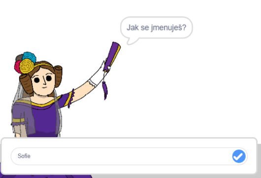
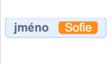
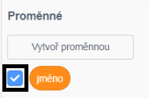
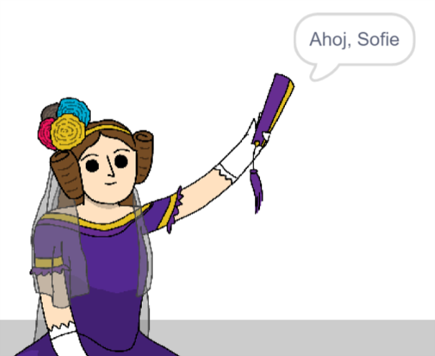

## Řekni Adě své jméno

Ada se představila, ale tvoje jméno ještě nezná!

\--- task \---

Přetáhni do svého kódu blok `otázka`{:class="block3sensing"} (ze sekce `vnímání`{:class="block3sensing"}). Tvůj kód by měl vypadat takto:


```blocks3
when this sprite clicked
say [Hi, I'm Ada!] for (2) seconds
+ ask [What's your name?] and wait
```

\--- /task \---

\--- task \---

Klikni na Adu a otestuj svůj kód. Ada by se měla zeptat na tvé jméno, které tam můžeš napsat!



\--- /task \---

\--- task \---

Pro uložení tvého jméno můžeme použít **proměnnou**. Klikni na `Proměnné`{: class = "block3variables"} a poté na „Vytvoř proměnnou“. Jelikož bude tato proměnná použita pro uložení tvého jména, pojďme ji nazvat třeba... `jméno`{:class="block3variables"}!

[[[generic-scratch3-add-variable]]]

\--- /task \---

\--- task \---

Abychom tvoje jméno uložili, klikni na záložku `Proměnné`{:class="block3variables"} a poté přetáhni na konec kódu blok `nastav jméno`{:class="block3variables"}.


```blocks3
when this sprite clicked
say [Hi, I'm Ada!] for (2) seconds
ask [What's your name?] and wait
+ set [name v] to [0]
```

\--- /task \---

\--- task \---

Pro uložení odpovědi, kterou zadáš, použij blok `odpověď`{:class="block3sensing"}.


```blocks3
when this sprite clicked
say [Hi, I'm Ada!] for (2) seconds
ask [What's your name?] and wait
set [name v] to (answer :: +)
```

\--- /task \---

\--- task \---

Klikni na Adu a otestuj svůj kód a jakmile se tě zeptá na jméno, zadej ho. Tvoje jméno by mělo být uloženo v proměnné `jméno`{:class="block3variables"}.



\--- /task \---

\--- task \---

Nyní můžeš v kódu své jméno použít. Přidej tento kód:


```blocks3
when this sprite clicked
say [Hi, I'm Ada!] for (2) seconds
ask [What's your name?] and wait
set [name v] to (answer)
+say (join [Hi ] (name)) for (2) seconds 
```

Pro vytvoření tohoto kódu:

1. Přetáhni blok `spoj`{:class="blockoperators"} do bloku `bublina`{:class="blocklooks"}
    
    ```blocks3
    say (join [apple] [banana] :: +) for (2) seconds
    ```

2. Přidej svůj blok `jméno`{:class="blockdata"} do bloku `spoj`{:class="blockoperators"}.
    
    ```blocks3
    say (join [Hi] (name :: variables +)) for (2) seconds
    ```

\--- /task \---

\--- task \---

Jestli chceš na scéně skrýt svoji proměnnou `jméno`{:class="block3variables"}, klikni na zatržítko vedle proměnné.



\--- /task \---

\--- task \---

Otestuj svůj nový kód. Ada by tě měla s použitím tvého jména pozdravit!



Pokud mezi slovem „Ahoj“ a tvým jménem není žádná mezera, musíš ji do kódu přidat!

\--- /task \---

\--- task \---

Nakonec přidej tento kód a vysvětli, co dělat dále:


```blocks3
when this sprite clicked
say [Hi, I'm Ada!] for (2) seconds
ask [What's your name?] and wait
set [name v] to (answer)
say (join [Hi ] (name)) for (2) seconds 
+ say [Click the computer to generate a poem.] for (2) seconds 
```

\--- /task \---

\--- task \---

Otestuj naposledy Ady kód a ujisti se, že všechno funguje.

\--- /task \---