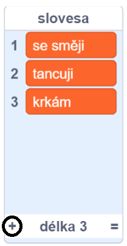
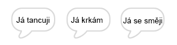

## Analytický stroj

Pojďme naprogramovat Ady počítač (nazvaný „analytický stroj“) tak, aby vygeneroval poezii.

\--- task \---

Přidej tento kód do postavy „Computer“ tak, aby po kliknutí na ní mluvila:


```blocks3
when this sprite clicked
say [Here is your poem...] for (2) seconds
```

\--- /task \---

\--- task \---

Chceš-li vygenerovat náhodnou báseň, nejprve budeš potřebovat **seznam** slov. Pokud chceš vytvořit nový seznam klikni na záložku `Proměnné`{:class="block3variables"}.

Pojďme do prvního řádku tvé básně použít **slovesa** (slova, vyjadřující činnost). Vytvoř nový seznam s názvem `slovesa`{:class="block3variables"}.

[[[generic-scratch3-make-list]]]

\--- /task \---

\--- task \---

Tvůj nový seznam bude prázdný. V dolní části tvého prázdného seznamu klikni na `+` a přidej následující slovesa:



\--- /task \---

\--- task \---

Na prvním řádku tvé básně by mělo být slovo „Já“, po kterém bude následovat náhodné sloveso.

Pro vytvoření tohoto řádku je třeba:

1. `náhodné číslo od`{:class="block3operators"} `1` a `délka slovesa`{:class="block3variables"}:
    
    ```blocks3
    (pick random (1) to (length of [verbs v]))
    ```

2. Použít tento blok `prvek`{:class="block3variables"} pro získání náhodného prvku ze seznamu `slovesa`{:class="block3variables"}:
    
    ```blocks3
    (item (pick random (1) to (length of [verbs v]) :: +) of [verbs v])
    ```

3. `spoj`{:class="block3operators"} "Já " s náhodným slovesem pro vytvoření prvního řádku tvé básně:
    
    ```blocks3
    (join [I ] (item (pick random (1) to (length of [verbs v])) of [verbs v] :: +))
    ```

4. Použij blok `bublina`{:class="block3looks"} pro zobrazení řádku tvé poezie:
    
    ```blocks3
    say (join [I ](item (pick random (1) to (length of [verbs v])) of [verbs v]) :: +) for (2) seconds
    ```

Tvůj kód by měl vypadat takto:


```blocks3
when this sprite clicked
say [Here is your poem...] for (2) seconds
+ say (join [I ](item (pick random (1) to (length of [verbs v])) of [verbs v])) for (2) seconds
```

\--- /task \---

\--- task \---

Svůj kód párkrát vyzkoušej. Tvůj počítač by měl pokaždé vybrat náhodné slovo ze seznamu `slovesa`{:class="block3variables"}.



\--- /task \---