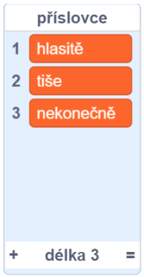
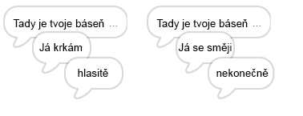
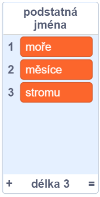
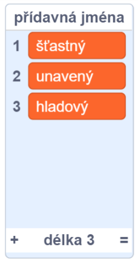
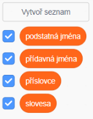

## Více poezie

Tvoje báseň je tak trochu krátká. Pojďme ji udělat delší!

--- task ---

V dalším řádku tvé básně použijme příslovce. **Příslovce** je slovo, které vyjadřuje bližší okolnosti dějů. Vytvoř další seznam s názvem příslovce a přidej tato 3 slova:



--- /task ---

--- task ---

Pro vypsání náhodného příslovce v dalším řádku tvé básně, přidej tento řádek do kódu počítače:


```blocks3
when this sprite clicked
say [Tady je tvoje báseň,] for (2) seconds
say (join [Já ](item (pick random (1) to (length of [slovesa v])) of [slovesa v])) for (2) seconds
+say (item (pick random (1) to (length of [příslovce v])) of [příslovce v]) for (2) seconds
```

--- /task ---

--- task ---

Svůj kód párkrát vyzkoušej. Pokaždé by se měla zobrazit jiná báseň.



--- /task ---

--- task ---

Do svého projektu přidej seznam s podstatnými jmény. **Podstatné jméno** označuje název osoby, zvířete, věci, vlastnosti a děje.



--- /task ---

--- task ---

Aby se podstatná jména ve tvém kódu používala, přidej tento kód.


```blocks3
when this sprite clicked
say [Tady je tvoje báseň,] for (2) seconds
say (join [Já ](item (pick random (1) to (length of [slovesa v])) of [slovesa v])) for (2) seconds
say (item (pick random (1) to (length of [příslovce v])) of [příslovce v]) for (2) seconds
+say (join [u ](item (pick random (1) to (length of [podstatná jména v])) of [podstatná jména v])) for (2) seconds
```

--- /task ---

--- task ---

Do svého projektu přidej seznam s přídavnými jmény. **Přídavné jméno** označuje vlastnost nebo vztah podstatného jména.



--- /task ---

--- task ---

Aby se přídavná jména ve tvém kódu používala, přidej tento kód:


```blocks3
when this sprite clicked
say [Tady je tvoje báseň,] for (2) seconds
say (join [Já ](item (pick random (1) to (length of [slovesa v])) of [slovesa v])) for (2) seconds
say (item (pick random (1) to (length of [příslovce v])) of [příslovce v]) for (2) seconds
say (join [u ](item (pick random (1) to (length of [podstatná jména v])) of [podstatná jména v])) for (2) seconds
+ say (join [cítím se ](item (pick random (1) to (length of [přídavná jména v])) of [přídavná jména v])) for (2) seconds
```

--- /task ---

--- task ---

Pokud chceš seznamy skrýt, můžeš vedle nich odškrtnout políčka.



--- /task ---

--- task ---

Vyzkoušej svoji novou báseň.

--- /task ---