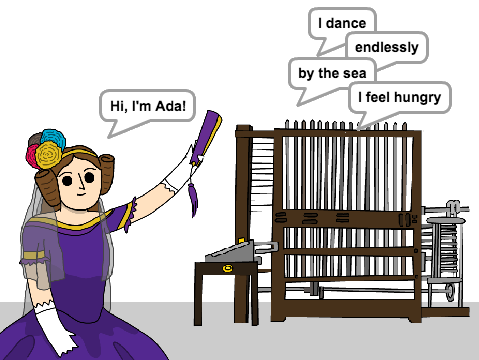

## Cyflwyniad

Rwyt ti mynd i ddysgu sut i raglenni peiriant barddoniaeth!

  <iframe allowtransparency="true" width="485" height="402" src="https://scratch.mit.edu/projects/embed/246281938/?autostart=false" frameborder="0"></iframe>
  

### Gwybodaeth ychwanegol i arweinydd y clwb

Os oes angen i chi argraffu'r prosiect yma, defnyddiwch y [fersiwn addas i'w argraffu](https://projects.raspberrypi.org/cy-GB/projects/poetry-generator/print).

--- collapse ---
---
title: Nodiadau i arweinydd y clwb
---

## Cyflwyniad:
Yn y prosiect yma, bydd plant yn dysgu sut i ddefnyddio newidyn a rhestrau i greu barddoniaeth ar hap.

## Diwrnod Ada Lovelace
Mae'r prosiect yma wedi ei greu i ddathlu Diwrnod Ada Lovelace. Os ydych chi'n  athro, mae modd lawrlwytho Pecyn Adnoddau Ysgol sydd yn cynnwys cynllun gwasanaeth ([downloads.codeclub.org.uk/ada.zip](http://downloads.codeclub.org.uk/ada.zip)), i gyflwyno plant i Ada a'i syniadau chwyldroadol. 

## Adnoddau
Ar gyfer y prosiect yma, dylid defnyddio Scratch 2.  Mae modd defnyddio Scratch 2 arlein yma [jumpto.cc/scratch-on](http://jumpto.cc/scratch-on) neu mae modd ei lawrlwytho yma [jumpto.cc/scratch-off](http://jumpto.cc/scratch-off) a'i ddefnyddio heb gysylltiad gwe.

Mae'r ddolen 'Adnoddau Prosiect' ar gyfer y prosiect yma yn cynnwys yr adnoddau canlynol:

##### Adnoddau i Arweinwyr Clwb

Mae modd gweld y prosiect wedi ei gwblhau yma <a href="http://scratch.mit.edu/projects/246281938/#editor">online</a>, neu mae modd ei lawrlwytho wrth glicio ar ddolen 'Adnoddau'r Prosiect' ar gyfer y prosiect yma, sydd yn cynnwys:

+ PoetryGenerator.sb2

##### Adnoddau Prosiect

Ar gyfer y prosiect yma, mae modd i aelodau'r clwb ddefnyddio prosiect Scratch sydd yn cynnwys yr adnoddau angenrheidiol. Mae'r prosiect ar gael yma [https://scratch.mit.edu/projects/246282526/](https://scratch.mit.edu/projects/246282526/), neu mae modd ei lawrlwytho gan glicio'r 'Adnoddau Prosiect' sydd yn cynnwys:

+ PoetryGeneratorResources.sb2

Sicrhewch fod gan bob plentyn fynediad i gopi o'r adnoddau yma.

## Nodau Dysgu
+ Newidyn;
+ Rhestrau a rhestrau ar hap; 
+ Ailadrodd (y bloc `ailadrodd`{:class="blockcontrol"}).

Mae'r prosiect yma yn trin elfennau sydd yn rhan o'r adran ganlynol o [Faes Llafur Gwneud Digidol Raspberry Pi](https://rpf.io/curriculum):

+ [Defnyddio rhaglenni sylfaenol i greu rhaglen syml](https://www.raspberrypi.org/curriculum/programming/creator)

## Heriau
+ "Codio Ada i gyflwyno ei hunan" - Newid y testun yn y bloc côd `dweud`{:class="blocklooks"};
+ "Personoleiddio dy gerdd" - Defnyddio newidyn o fewn y bloc `dweud`{:class="blocklooks"};
+ "Mwy o eiriau" - Ychwanegu mwy o ferfau, adferfau, enwau ac ansoddeiriau i'r rhestrau;
+ "Mwy o gerddi" - Defnyddio rhestrau gwahanol i gerdd cerdd wahanol.

--- /collapse ---

--- collapse ---
---
title: Adnoddau Prosiect
---
## Adnoddau prosiect
* [Prosiect Scratch 2 arlein yn cynnwys adnoddau allanol](https://scratch.mit.edu/projects/246282526/)
* [Prosiect Scratch 2 mae modd ei lawrlwytho yn cynnwys adnoddau allanol](resources/PoetryGeneratorResources.sb2)

## Adnoddau arweinwyr clwb
* [Prosiect Scratch 2 arlein wedi ei gwblhau](https://scratch.mit.edu/projects/246281938/)
* [Prosiect Scratch 2 wedi ei gwblhau mae modd ei lawrlwytho](resources/PoetryGenerator.sb2)

--- /collapse ---
