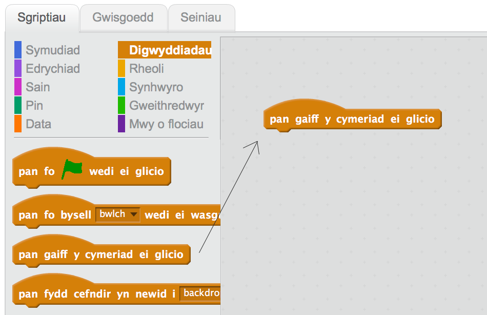
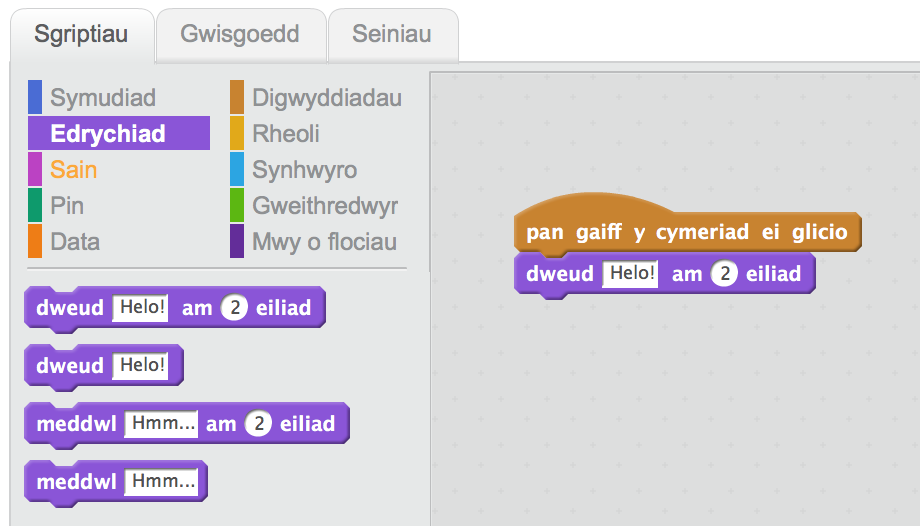
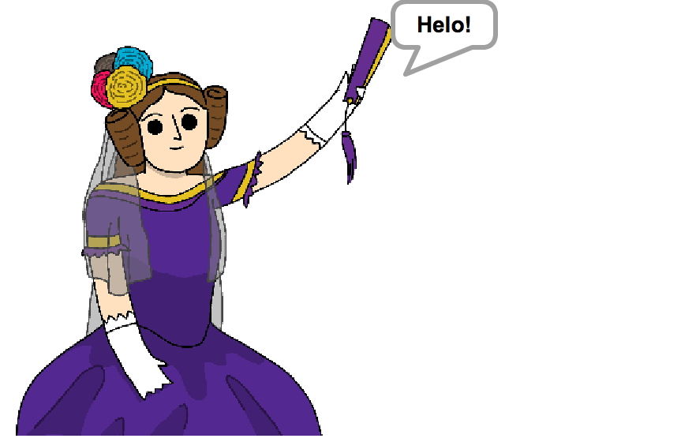

## Ada Lovelace

Yn 1842, fe ysgrifenodd Ada Lovelace am ddefnyddio peiriant o'r enw'r 'Peiriant Dadansoddol' i wneud symiau, ac mae'n cael ei hadnabod fel y rhaglenwr cyfrifiadur cyntaf! Ada oedd hefyd y cyntaf i weld bod modd i gyfrifiaduron wneud mwy na bod yn gyfrfiannell fawr yn unig.

+ Agora'r prosiect Scratch 'Peiriant Barddoniaeth' arlein <a href="https://scratch.mit.edu/projects/246282526/
" target="_blank">jumpto.cc/poetry-go</a> neu lawrlwytha o [jumpto.cc/poetry-get](resources/PoetryGeneratorResources.sb2) yna ei agor os wyt ti'n defnyddio'r golygydd ar y cyfrifiadur.

+ Clicia giplun 'Ada' a dewis y tab `Digwyddiadau`{:class="blockevents"} yn yr adran 'Sgriptiau'.  Llusga'r bloc `pan gaiff y cymeriad ei glicio`{:class="blockevents"} i'r ardal côd ar y dde.

Bydd unrhyw gôd sydd yn cael ei ychwanegu o dan y bloc yma yn rhedeg pan mae Ada yn cael ei chlicio!

+ Clicia'r tab `Edrychiad`{:class="blocklooks"}, a llusga'r bloc `dweud`{:class="blocklooks"} `Helo!` `am 2 eiliad`{:class="blocklooks"} o dan y côd rwyt ti wedi ei ychwanegu yn barod.

+ Clicia Ada, ac fe ddylai siarad gyda ti.

