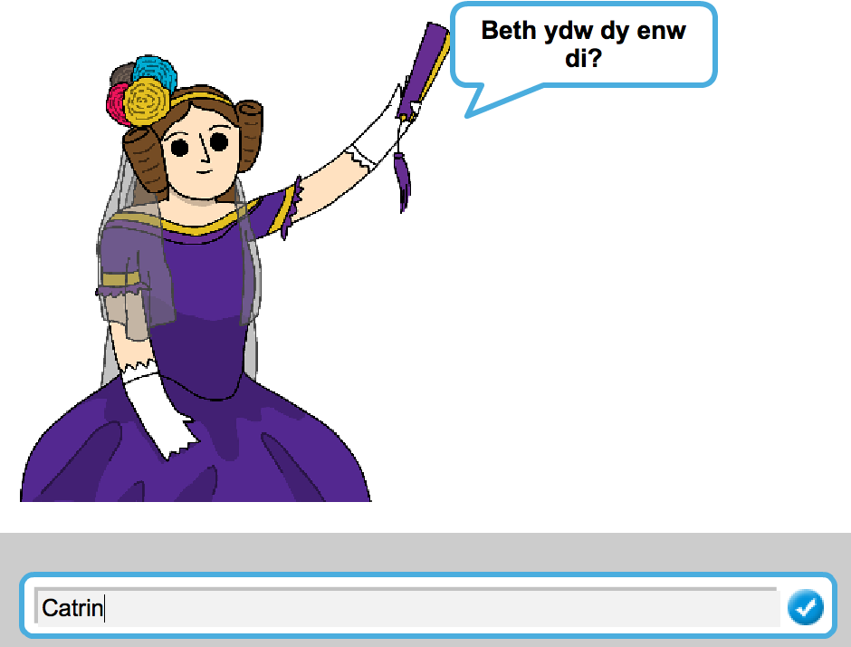
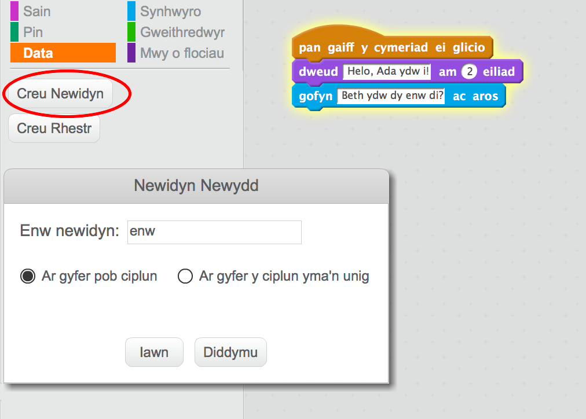
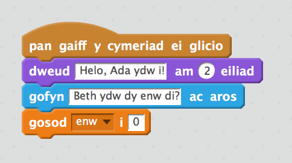
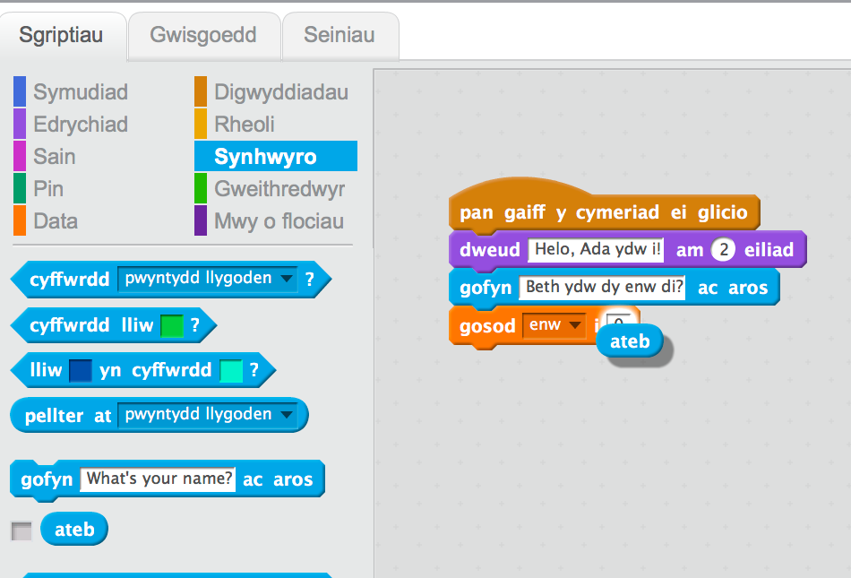
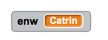
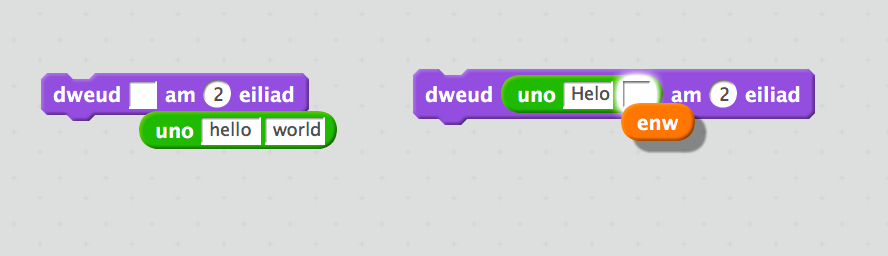
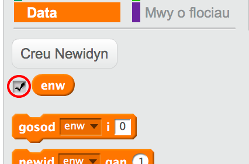
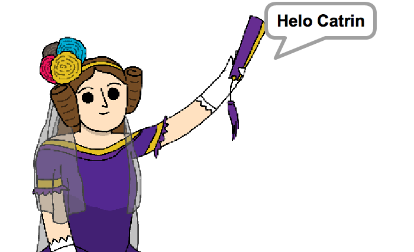

## Dweud dy enw wrth Ada

Mae Ada wedi cyflwyno ei hunan, ond dyw hi ddim yn gwybod dy enw di!


+ Llusga bloc `gofyn`{:class="blocksensing"} (o'r adran  `synhwyro`{:class="blocksensing"} i dy gôd. Dyma sut ddylai dy gôd edrych:

```blocks
pan caiff y cymeriad ei glicio
dweud [Helo, Ada ydw i!] am (2) eiliad
gofyn [Beth yw dy enw di?] ac aros
```

+ Clicia ar Ada i brofi dy gôd. Fe ddylai Ada ofyn dy enw, ac mae modd i ti ei deipio i'w ateb!



+ Mae modd i ni ddefnyddio __newidyn__ i storio dy enw. Clicia `Data`{:class="blockdata"} yna 'Creu Newidyn'.  Gan fod hwn yn newidyn bydd yn cael ei ddefnyddio i storio dy enw, fe wnawn ei alw'n `enw`{:class="blockdata"}!



+ I storio dy enw, clicia'r tab `Data`{:class="blockdata"} yna llusgo bloc `gosod enw`{:class="blockdata"} ar ddiwedd dy gôd.



+ Defnyddia'r bloc `ateb`{:class="blocksensing"} i storio'r ateb rwyt ti'n ei deipio.



+ Clicia Ada i brofi dy gôd ac i depio dy enw pan mae'n gofyn. Bydd dy enw yn cael ei storio yn y newidyn `enw`{:class="blockdata"}.



+ Mae modd i ti nawr ddefnyddio dy enw yn rhan o dy gôd. Ychwanega'r côd yma:

```blocks
dweud (uno [Helo ] (enw))
```

I greu'r côd yma, llusga'r bloc `uno`{:class="blockoperators"} ar y bloc `dweud`{:class="blocklooks"}, yna ychwanega'r bloc `enw`{:class="blockdata"} i'r bloc `uno`{:class="blockoperators"} 



+ I guddio'r newidyn `enw`{:class="blockdata"} ar y llwyfan, clicia'r tic drws nesaf i'r newidyn.



+ Profa dy gôd newydd. Fe ddylai Ada ddweud helo yn defnyddio dy enw!



Os nad oes bwlch rhwng y gair 'Helo' a dy enw, bydd angen i ti ychwanegu bwlch yn y côd dy hunan.

+ Ychwanega'r côd yma i esbonio beth i'w wneud nesaf:

```blocks
dweud [Clicia'r cyfrifiadur i greu cerdd] am (2) eiliad
```

+ Profa côd Ada un tro olaf, i sicrhau bod popeth yn gweithio'n iawn. Dyma sut ddylai dy gôd edrych:

```blocks
pan caiff y cymeriad ei glicio
dweud [Helo, Ada ydw i!] am (2) eiliad
gofyn [Beth yw dy enw di??] ac aros
gosod [enw v] i (ateb)
dweud (uno [Helo ] (enw)) am (2) eiliad
dweud [Clicia'r cyfrifiadur i greu cerdd.] am (2) eiliad
```


