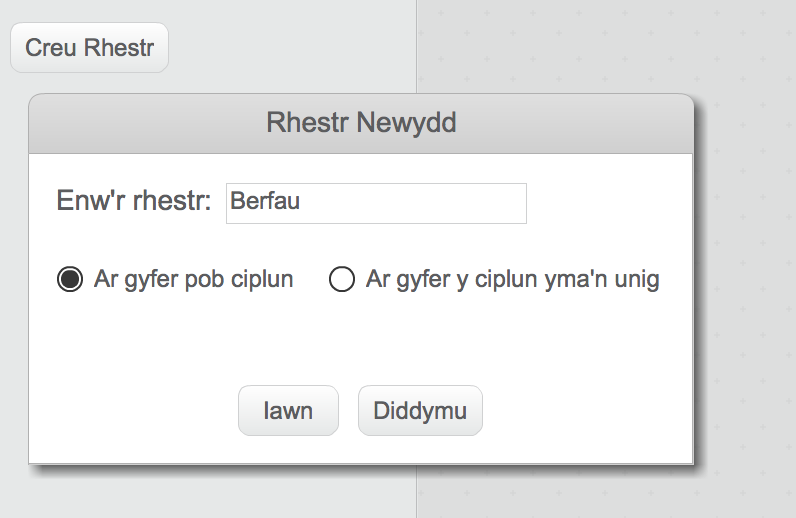
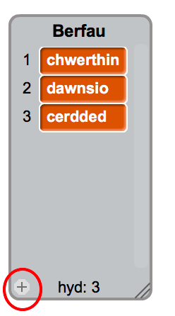
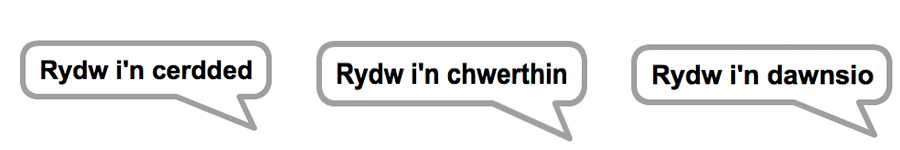

## Y Peiriant Dadansoddol

Fe awn ati i raglenni cyfrifiadur Ada (sef y 'Peiriant Dadansoddol') i greu barddoniaeth.

+ Ychwanega'r côd yma i giplun y Cyfrifiadur, fel ei fod yn siarad pan rwyt ti'n ei glicio:

```blocks
pan caiff y cymeriad ei glicio
dweud [Dyma dy gerdd...] am (2) eiliad
```

+ I greu cerdd ar hap, yn gyntaf bydd angen __rhestr__ o eiriau i'w defnyddio. I greu rhestr newydd, clicia'r tab `Data`{:class="blockdata"}.

Fe wnawn ni ddefnyddio __berfau__ (gair sy'n dynodi gweithred) yn llinell gyntaf dy gerdd. Bydd angen creu rhestr newydd o'r enw 'Berfau'.



+ Bydd dy restr newydd yn wag. Clicia'r `+` ar waelod dy restr gwag ac ychwanegu'r berfau yma:



+ Bydd llinell gyntaf dy gerdd yn cynnwys "Rydw i'n", gan ddilyn gyda berf ar hap. Dyma'r côd fydd angen ychwanegu:

```blocks
pan caiff y cymeriad ei glicio
dweud [Dyma dy gerdd...] am (2) eiliad
dweud (uno [Rydw i'n ] (eitem (ar hap v) o [berfau v] :: list)) am (2) eiliad
```

+ Profa dy gôd cwpwl o weithiau. Fe ddylai dy gyfrifiadur ddweud gair ar hap o dy restr bob tro.




