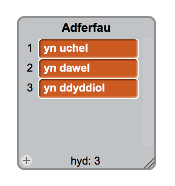
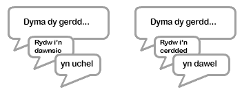
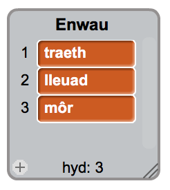
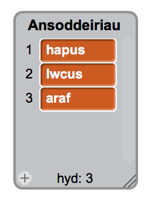
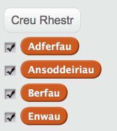

## Mwy o farddoniaeth

Mae dy gerdd yn eithaf byr - awn ati i ychwanegu ati!


+ Fe wnawn ni ddefnyddio adferfau yn llinell nesaf dy gerdd. Mae __adferf__ yn air sydd yn disgrifio berf. Bydd angen creu rhestr arall o'r enw adferfau, ac ychwanegu'r 3 gair yma:



+ Ychwanega'r llinell yma i côd dy gyfrifiadur, i ddweud adferf ar hap yn llinell nesaf dy gerdd:

```blocks
dweud (eitem (ar hap v) o [adferfau v] :: list) am (2) eiliad
```

+ Profa dy gôd cwpwl o weithiau. Fe ddylai greu cerdd ar hap bob tro.



+ Ychwanega rhestr o enwau i dy brosiet. Mae __enw__ yn lle neu yn bethau.



+ Ychwanega'r côd yma i ddefnyddio enwau yn dy gerdd.

```blocks
dweud (uno [wrth y ] (eitem (ar hap v) o [enwau v] :: list)) am (2) eiliad
```

+ Ychwanega rhestr o ansoddeiriau i dy brosiect. Mae __ansoddair__ yn air sydd yn disgrifio.



+ Ychwanega côd i ddefnyddio'r ansoddeiriau yn dy gerdd:

```blocks
dweud (uno [Rydw i'n teimlo'n ] (eitem (ar hap v) o [ansoddeiriau v] :: list)) am (2) eiliad
```

+ Mae modd i ti glicio'r bocs drws nesaf i'r rhestr i'w cuddio nhw.



+ Profa dy gerdd newydd. Dyma'r côd ddylai fod gen ti ar y sgrin:

```blocks
pan caiff y cymeriad ei glicio
dweud [Dyma dy gerdd...] am (2) eiliad
dweud (uno [Rydw i'n ] (eitem (ar hap v) o [berfau v] :: list)) am (2) eiliad
dweud (eitem (ar hap v) o [adferfau v] :: list) am (2) eiliad
dweud (uno [wrth y ] (eitem (ar hap v) o [enwau v] :: list)) am (2) eiliad
dweud (uno [Rydw i'n teimlo'n ] (eitem (ar hap v) o [ansoddeiriau v] :: list)) am (2) eiliad
```


