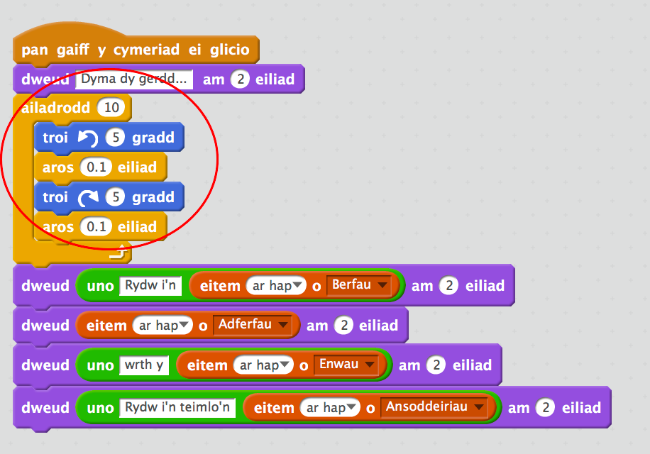
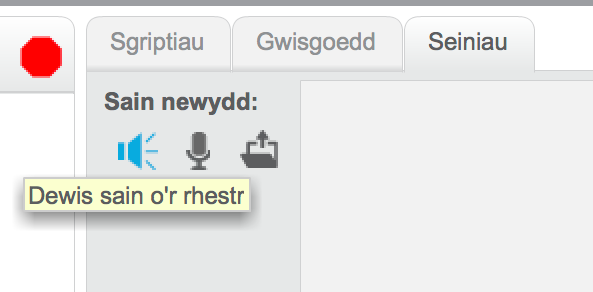
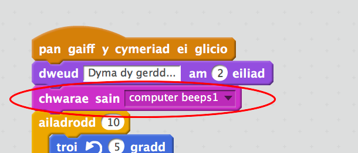

## Animeiddio'r Peiriant Dadansoddol

Awn ati i animeiddio dy gyfrifiadur, fel ei fod yn edrych fel ei fod yn creu cerddi.


+ Clicia ciplun y cyfrifiadur, ac ychwanega'r côd yma ar ôl y bloc cyntaf `dweud`{:class="blocklooks"}:

```blocks
ailwna (10) 
  troi ↺ (5) gradd
  aros (0.1) eiliad
  troi ↻ (5) gradd
  aros (0.1) eiliad
end
```

Dyma sut ddylai dy gôd edrych:



Fe wnei di ddod o hyd i'r blociau `ailadrodd`{:class="blockcontrol"} ac `aros`{:class="blockcontrol"} yn yr adran `Rheoli`{:class="blockcontrol"}.

+ Profa dy brosiect. Fe ddylai'r cyfrifiadur siglo cyn creu cerdd!


+ Clicia'r tab 'Seiniau' a chlicio 'Dewis sain o'r rhestr'.



+ Dewisa sain 'computer beeps' a chlicio Iawn.


+ Ychwanega bloc `chwarae sain`{:class="blocksound"} i chwarae'r sain cyn i'r animeiddio gychwyn.




