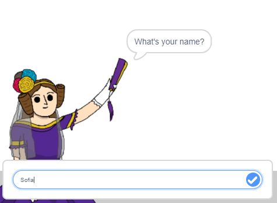

## Fortæller Ada dit navn

Ada har præsenteret sig selv, men hun kender ikke dit navn!

\--- task \---

Træk en `ask`{: class = "block3sensing"} -blok (fra sektionen `sensing`{: class = "block3sensing"}) til din kode. Sådan ser din kode ud:


```blocks3
when this sprite clicked
say [Hi, I'm Ada!] for (2) seconds
+ ask [What's your name?] and wait
```

\--- /task \---

\--- task \---

Klik på Ada for at teste din kode. Ada skulle bede dig om dit navn, som du kan indtaste!



\--- /task \---

\--- task \---

Vi kan bruge en **variabel** til at gemme dit navn. Klik på `Data`{: class = "block3variables"}, og derefter på 'Lav en variabel'. Da denne variabel vil blive brugt til at gemme dit navn, lad os kalde variablen ... `navn`{: class = "block3variables"}!

[[[generic-scratch3-add-variable]]]

\--- /task \---

\--- task \---

For at gemme dit navn skal du klikke på fanen `Data`{: class = "block3variables"} og derefter trække `sætnavnet`{: class = "block3variables"} blok til slutningen af din kode.


```blocks3
when this sprite clicked
say [Hi, I'm Ada!] for (2) seconds
ask [What's your name?] and wait
+ set [name v] to [0]
```

\--- /task \---

\--- task \---

Brug `svaret`{: class = "block3sensing"} -blokken til at gemme det svar, du skriver i.


```blocks3
when this sprite clicked
say [Hi, I'm Ada!] for (2) seconds
ask [What's your name?] and wait
set [name v] to (answer :: +)
```

\--- /task \---

\--- task \---

Klik på Ada for at teste din kode, og indtast dit navn, når du bliver spurgt. Du skal se, at dit navn er blevet gemt i variablen `name`{: class = "block3variables"}.


\--- /task \---

\--- task \---

Du kan nu bruge dit navn i din kode. Tilføj denne kode:


```blocks3
when this sprite clicked
say [Hi, I'm Ada!] for (2) seconds
ask [What's your name?] and wait
set [name v] to (answer)
+say (join [Hi ] (name)) for (2) seconds 
```

Sådan opretter du denne kode:

1. Træk en `sammenføjning`{: class = "blockoperators"} -blok ind på `siger`{: class = "blocklooks"} -blokken
    
    ```blocks3
    say (join [apple] [banana] :: +) for (2) seconds
    ```

2. Tilføj din `navn`{: class = "blockdata"} blok på `join`{: class = "blockoperators"} blokken.
    
    ```blocks3
    say (join [Hi] (name :: variables +)) for (2) seconds
    ```

\--- /opgave \---

\--- opgave \---

For at skjule din `navn`{: class = "block3variables"} -variabel på scenen, skal du klikke på krydset ved siden af variablen.


\--- /opgave \---

\--- opgave \---

Test din nye kode. Ada skal sige hej til dig ved hjælp af dit navn!


Hvis der ikke er noget mellemrum mellem ordet 'Hej' og dit navn, skal du selv tilføje et mellemrum i koden!

\--- /opgave \---

\--- opgave \---

Til sidst skal du tilføje denne kode for at forklare, hvad du skal gøre næste:


```blocks3
when this sprite clicked
say [Hi, I'm Ada!] for (2) seconds
ask [What's your name?] and wait
set [name v] to (answer)
say (join [Hi ] (name)) for (2) seconds 
+ say [Click the computer to generate a poem.] for (2) seconds 
```

\--- /opgave \---

\--- opgave \---

Test Adas kode en sidste gang for at sikre dig, at alt fungerer.

\--- /opgave \---