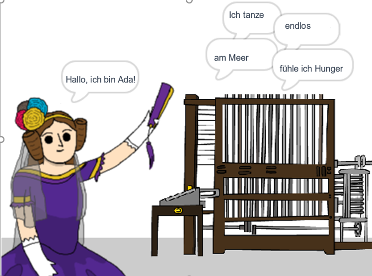

\--- no-print \---

Dies ist die **Scratch 3** Version des Projekts. Es gibt auch eine [Scratch 2 Version des Projekts](https://projects.raspberrypi.org/en/projects/poetry-generator-scratch2).

\--- /no-print \---

## Einleitung

Du wirst lernen, deinen eigenen Gedichtsersteller zu programmieren!

\--- no-print \---

  <iframe allowtransparency="true" width="485" height="402" src="https://scratch.mit.edu/projects/embed/77844926/?autostart=false" frameborder="0" scrolling="no"></iframe>
  

\--- /no-print \---

\--- print-only \---

\--- /print-only \---

## \--- collapse \---

## title: Was du lernen wirst

+ Variablen;
+ Listen und zufällige Listenelemente;
+ Wiederholung (der `Wiederholungsblock`{:class="block3control"}).

\--- /collapse \---

## \--- collapse \---

## title: Was du brauchen wirst

#### Hardware

+ Ein Computer, auf dem Scratch 3 ausgeführt werden kann

#### Software

+ Scratch 3 (entweder [online](http://rpf.io/scratchon){:target="_blank"} oder [offline](http://rpf.io/scratchoff){:target="_blank"})

#### Downloads

Das Start-Projekt findest du [hier](http://rpf.io/p/en/poetry-generator-go){:target="_blank"}.

\--- /collapse \---

## \--- collapse \---

## title: Zusätzliche Informationen für Pädagogen

Dieses Projekt wurde erstellt, um den [Ada Lovelace Tag](https://findingada.com) zu feiern. Wenn Sie Lehrer sind, können Sie ein Schulressourcenpaket herunterladen, das auch einen Veranstaltungs-Plan enthält ([downloads.codeclub.org.uk/ada.zip](http://downloads.codeclub.org.uk/ada.zip)), um Kindern Ada und ihre revolutionären Ideen vorzustellen.

\--- no-print \---

Wenn du dieses Projekt ausdrucken möchtest, verwende die [druckerfreundliche Version](https://projects.raspberrypi.org/en/projects/poetry-generator/print){:target="_blank"}.

\--- /no-print \---

Du findest das [abgeschlossene Projekt hier](http://rpf.io/p/en/poetry-generator-get){:target="_blank"}.

\--- /collapse \---