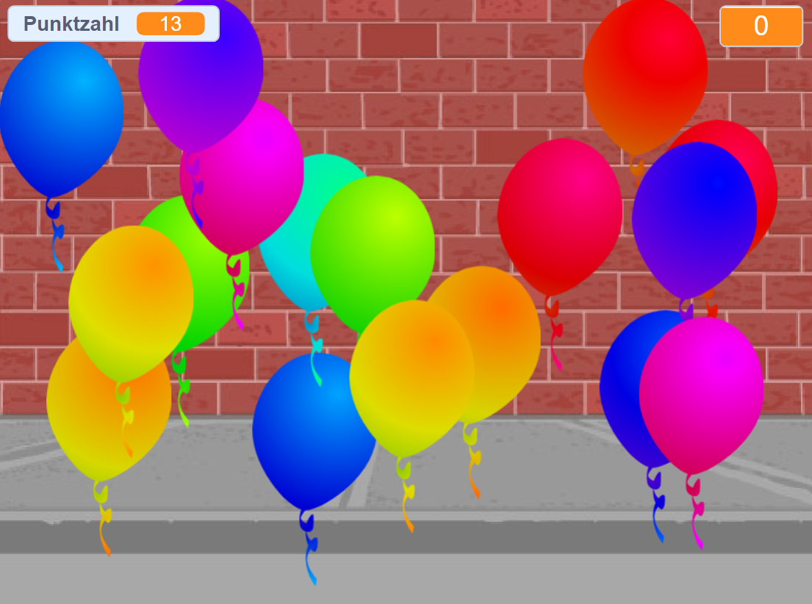

## Wie geht's weiter?

Schaue dir das [Ballons](https://projects.raspberrypi.org/en/projects/balloons) Scratch-Projekt an.

--- no-print ---

Lasse sie platzen, indem du auf sie klickst.

  <iframe allowtransparency="true" width="485" height="402" src="https://scratch.mit.edu/projects/embed/299206746/?autostart=false" frameborder="0" scrolling="no"></iframe>
  

--- /no-print ---

--- print-only ---

--- /print-only ---

***

Dieses Projekt wurde von freiwilligen Helfern übersetzt:

Dennis Webber
Tim

Dank freiwilliger Helfer können wir Menschen auf der ganzen Welt die Möglichkeit geben, in ihrer eigenen Sprache zu lernen. Du kannst uns helfen, mehr Menschen zu erreichen, indem Du dich freiwillig zum Übersetzen meldest - weitere Informationen unter [rpf.io/translate](https://rpf.io/translate).