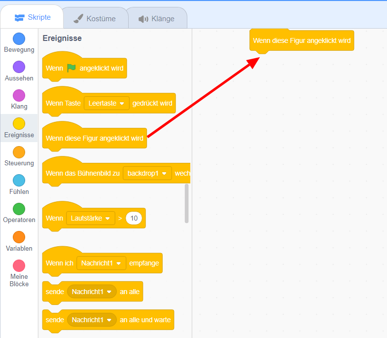
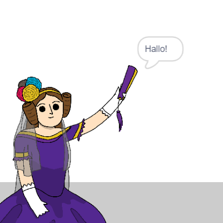

## Ada Lovelace

1842 schrieb Ada Lovelace über die Verwendung einer Maschine namens "Analytical Engine" (Analytische Maschine), um Berechnungen durchzuführen, und gilt als der weltweit erste Computerprogrammierer! Ada war auch die erste, die erkannte, dass Computer mehr als nur große Taschenrechner sein können.

\--- task \---

Öffne das Scratch-Starterprojekt 'Poetry Generator' (Poesieersteller).

**Online**: Öffne das [Starter-Projekt](http://rpf.io/poetry-on){:target="_blank"}.

Wenn du bereits einen Scratch-Account besitzt, kannst du dir durch Klick auf **Remix** eine Kopie anlegen.

**Offline**: Öffne das [Starter-Projekt](http://rpf.io/p/en/beat-the-goalie-go){:target="_blank"} im Offline-Editor.

Wenn du Scratch herunterladen und auf deinem Rechner installieren möchtest, dann findest du die Datei unter diesem Link: [rpf.io/scratchoff](http://rpf.io/scratchoff){:target="_blank"}.

\--- /task \---

\--- task \---

Klicke auf deine 'Ada'-Figur und klicke im Codierungsabschnitt 'Skripte' auf die Registerkarte `Ereignisse`{:class="block3events"}. Ziehe die `wenn dieses Sprite geklickt wird`{:class="block3events"} Block auf den Codierungsbereich rechts.




Jeder Code, der unter diesem Block hinzugefügt wird, wird ausgeführt, wenn auf Ada geklickt wird!

\--- /task \---

\--- task \---

Klicke auf die Registerkarte `Aussehen`{:class="block3looks"} und ziehe den `sage`{:class="block3looks"} `Hallo!` `für 2 Sekunden`{:class="block3looks"} Block unter dem `wenn diese Figur angeklickt wird`{:class="block3events"} Block, den Du bereits hinzugefügt haben.


```blocks3
when this sprite clicked
say [Hello!] for (2) seconds
```

\--- /task \---

\--- task \---

Klicke auf Ada und du solltest sehen, wie sie mit dir spricht.



\--- /task \---