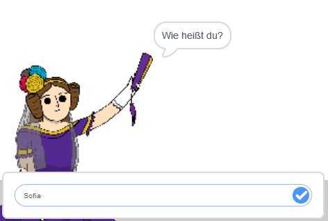

## Sage Ada deinen Namen

Ada hat sich vorgestellt, aber sie kennt deinen Namen nicht!

\--- task \---

Ziehe einen `frage`{:class="block3sensing"} -Block (aus dem Abschnitt `Fühlen`{:class="block3sensing"}) auf deinen Code. So sollte dein Code aussehen:


```blocks3
when this sprite clicked
say [Hi, I'm Ada!] for (2) seconds
+ ask [What's your name?] and wait
```

\--- /task \---

\--- task \---

Kicke auf Ada, um deinen Code zu testen. Ada sollte dich nach deinem Namen fragen, den du eingeben kannst!



\--- /task \---

\--- task \---

Wir können eine **Variable** verwenden, um deinen Namen zu speichern. Klicke auf `Daten`{:class="block3variables"} und dann auf "Variable erstellen". Da diese Variable zum Speichern deines Namens verwendet wird, rufen wir die Variable auf... `Name`{:class="block3variables"}!

[[[generic-scratch3-add-variable]]]

\--- /task \---

\--- task \---

Um deinen Namen zu speichern, klicke auf die Registerkarte `Daten`{:class="block3variables"} und ziehe dann den Block `setze Namen`{:class="block3variables"} an das Ende deines Codes.


```blocks3
when this sprite clicked
say [Hi, I'm Ada!] for (2) seconds
ask [What's your name?] and wait
+ set [name v] to [0]
```

\--- /task \---

\--- task \---

Verwende den `Antwort`{:class="block3sensing"} Block, um die eingegebene Antwort zu speichern.


```blocks3
when this sprite clicked
say [Hi, I'm Ada!] for (2) seconds
ask [What's your name?] and wait
set [name v] to (answer :: +)
```

\--- /task \---

\--- task \---

Klicke auf Ada, um deinen Code zu testen und gebe deinen Namen ein, wenn du dazu aufgefordert wirst. Du solltest sehen, dass dein Name in der Variablen `Name`{:class="block3variables"} gespeichert wurde.


\--- /task \---

\--- task \---

Du kannst jetzt deinen Namen in deinem Code verwenden. Füge diesen Code hinzu:


```blocks3
when this sprite clicked
say [Hi, I'm Ada!] for (2) seconds
ask [What's your name?] and wait
set [name v] to (answer)
+say (join [Hi ] (name)) for (2) seconds 
```

So erstellst du diesen Code:

1. Ziehe einen `verbinde`{:class="blockoperators"} Block auf den `sage`{:class="blocklooks"} Block
    
    ```blocks3
    say (join [apple] [banana] :: +) for (2) seconds
    ```

2. Füge deinen Block `Name`{:class="blockdata"} zum Block `verbinde`{:class="blockoperators"} hinzu.
    
    ```blocks3
    say (join [Hi] (name :: variables +)) for (2) seconds
    ```

\--- /task \---

\--- task \---

Um deine Variable `Name`{:class="block3variables"} auf der Bühne auszublenden, klicke auf das Häkchen neben der Variablen.


\--- /task \---

\--- task \---

Teste deinen neuen Code. Ada sollte dich mit deinem Namen begrüßen!


Wenn zwischen dem Wort "Hallo" und deinem Namen kein Leerzeichen steht, musst du dem Code selbst ein Leerzeichen hinzufügen!

\--- /task \---

\--- task \---

Füge abschließend diesen Code hinzu, um zu erklären, was als Nächstes zu tun ist:


```blocks3
when this sprite clicked
say [Hi, I'm Ada!] for (2) seconds
ask [What's your name?] and wait
set [name v] to (answer)
say (join [Hi ] (name)) for (2) seconds 
+ say [Click the computer to generate a poem.] for (2) seconds 
```

\--- /task \---

\--- task \---

Teste Adas Code ein letztes Mal, um sicherzustellen, dass alles funktioniert.

\--- /task \---