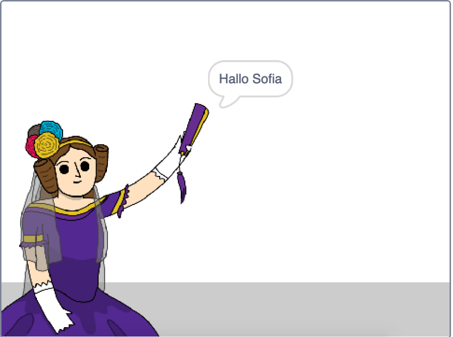

## Sage Ada deinen Namen

Ada hat sich vorgestellt, aber sie kennt deinen Namen nicht!

\--- task \---

Ziehe einen `frage`{:class="block3sensing"} -Block (aus dem Abschnitt `Fühlen`{:class="block3sensing"}) auf deinen Code. So sollte dein Code aussehen:


```blocks3
when this sprite clicked
say [Hi, I'm Ada!] for (2) seconds
+ ask [What's your name?] and wait
```

\--- /task \---

\--- task \---

Kicke auf Ada, um deinen Code zu testen. Ada sollte dich nach deinem Namen fragen, den du eingeben kannst!


\--- /task \---

\--- task \---

Wir können eine **Variable** verwenden, um deinen Namen zu speichern. Klicke auf `Daten`{:class="block3variables"} und dann auf "Variable erstellen". Da diese Variable zum Speichern deines Namens verwendet wird, rufen wir die Variable auf... `Name`{:class="block3variables"}!

[[[generic-scratch3-add-variable]]]

\--- /task \---

\--- task \---

Um deinen Namen zu speichern, klicke auf die Registerkarte `Daten`{:class="block3variables"} und ziehe dann den Block `setze Namen`{:class="block3variables"} an das Ende deines Codes.


```blocks3
when this sprite clicked
say [Hi, I'm Ada!] for (2) seconds
ask [What's your name?] and wait
+ set [name v] to [0]
```

\--- /task \---

\--- task \---

Verwende den `Antwort`{:class="block3sensing"} Block, um die eingegebene Antwort zu speichern.


```blocks3
when this sprite clicked
say [Hi, I'm Ada!] for (2) seconds
ask [What's your name?] and wait
set [name v] to (answer :: +)
```

\--- /task \---

\--- task \---

Klicke auf Ada, um deinen Code zu testen und gebe deinen Namen ein, wenn du dazu aufgefordert wirst. You should see that your name has been stored in the `name`{:class="block3variables"} variable.


\--- /task \---

\--- task \---

You can now make use of your name in your code. Add this code:


```blocks3
when this sprite clicked
say [Hi, I'm Ada!] for (2) seconds
ask [What's your name?] and wait
set [name v] to (answer)
+say (join [Hi ] (name)) for (2) seconds 
```

To create this code:

1. Drag a `join`{:class="blockoperators"} block onto the `say`{:class="blocklooks"} block
    
    ```blocks3
    say (join [apple] [banana] :: +) for (2) seconds
    ```

2. Add your `name`{:class="blockdata"} block onto the `join`{:class="blockoperators"} block.
    
    ```blocks3
    say (join [Hi] (name :: variables +)) for (2) seconds
    ```

\--- /task \---

\--- task \---

To hide your `name`{:class="block3variables"} variable on the stage, click the tick next to the variable.


\--- /task \---

\--- task \---

Test your new code. Ada should say hello to you, using your name!



If there's no space between the word 'Hi' and your name, you'll need to add a space into the code yourself!

\--- /task \---

\--- task \---

Finally, add this code to explain what to do next:


```blocks3
when this sprite clicked
say [Hi, I'm Ada!] for (2) seconds
ask [What's your name?] and wait
set [name v] to (answer)
say (join [Hi ] (name)) for (2) seconds 
+ say [Click the computer to generate a poem.] for (2) seconds 
```

\--- /task \---

\--- task \---

Test Ada's code one last time, to make sure that everything works.

\--- /task \---