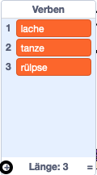

## Die analytische Maschine

Programmieren wir Adas Computer (genannt "Analytische Maschine"), um Gedichte zu erstellen.

\--- task \---

Füge diesen Code zu deiner Computer Figur hinzu, so dass es spricht, wenn es geklickt wird:


```blocks3
when this sprite clicked
say [Here is your poem...] for (2) seconds
```

\--- /task \---

\--- task \---

Um ein zufälliges Gedicht zu erstellen, brauchst du als erstes eine **Liste** mit Wörtern, die du benutzen willst. Um eine neue Liste zu erstellen, klicke auf die `Daten`{:class="block3variables"} Tabelle.

Lass uns **Verben** (Aktionswörter) in der ersten Gedichtszeile benutzen. Erstelle eine neue Liste mit dem Namen `Verben`{:class="block3variables"}.

[[[generic-scratch3-make-list]]]

\--- /task \---

\--- task \---

Deine neue Liste wird leer sein. Klicke auf das `+` am unteren Teil deiner leeren Liste und füge diese Verben hinzu:



\--- /task \---

\--- task \---

Die erste Linie deines Gedichtes sollte das Wort "Ich" gefolgt von einem zufälligen Verb sein.

Um eine neue Gedichtszeile zu erstellen, musst du:

1. `Wähle eine zufällige (englisch: random) Zahl`{:class="block3operators"} zwischen `1` und der `Länge der Liste mit Verben`{:class="block3variables"}:
    
    ```blocks3
    (pick random (1) to (length of [verbs v]))
    ```

2. Benutze diesen Codeblock, um ein zufälliges `Element`{:class="block3variables"} von der `Verben`{:class="block3variables"} Liste:
    
    ```blocks3
    (item (pick random (1) to (length of [verbs v]) :: +) of [verbs v])
    ```

3. `Verbinde`{:class="block3operators"} 'Ich' mit einem zufälligem Verb um die erste Gedichtszeile zu erstellen:
    
    ```blocks3
    (join [I ] (item (pick random (1) to (length of [verbs v])) of [verbs v] :: +))
    ```

4. Benutze einen `sage`{:class="block3looks"} Block, um die Gedichtszeile darzustellen:
    
    ```blocks3
    say (join [I ](item (pick random (1) to (length of [verbs v])) of [verbs v]) :: +) for (2) seconds
    ```

Dein Code sollte so aussehen:


```blocks3
when this sprite clicked
say [Here is your poem...] for (2) seconds
+ say (join [I ](item (pick random (1) to (length of [verbs v])) of [verbs v])) for (2) seconds
```

\--- /task \---

\--- task \---

Teste deinen Code ein paar Mal. Dein Computer sollte jedes Mal ein zufälliges Wort von der `Verben`{:class="block3variables"} Liste auswählen.


\--- /task \---