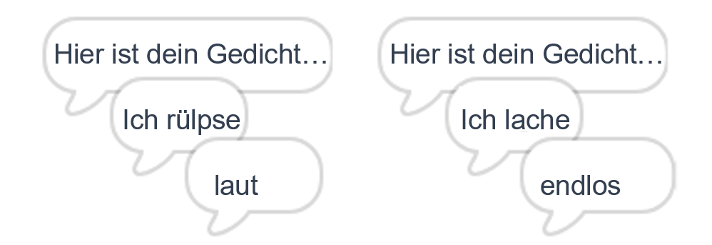
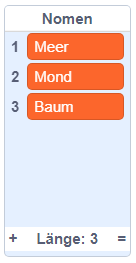
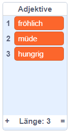
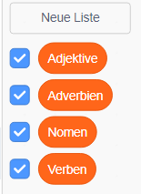

## Mehr Poesie

Dein Gedicht ist sehr kurz - lass uns etwas hinzufügen!

--- task ---

Lass uns Adverbien in der nächsten Gedichtszeile benutzen. Ein **Adverb** ist ein Wort, welches ein Verb beschreibt. Erstelle eine weitere Liste namens Adverbien und füge diese 3 Wörter hinzu:


--- /task ---

--- task ---

Füge diese Zeile zu deinem Computer Code hinzu, um ein zufälliges Adverb auf der nächsten Gedichtszeile zu sagen:


```blocks3
when this sprite clicked
say [Hier ist dein Gedicht…] for (2) seconds
say (join [Ich ](item (pick random (1) to (length of [Verben v])) of [Verben v])) for (2) seconds
+say (item (pick random (1) to (length of [Adverbien v])) of [Adverbien v]) for (2) seconds
```

--- /task ---

--- task ---

Teste deinen Code mehrmals. Du solltest jedes Mal ein zufälliges Gedicht sehen.



--- /task ---

--- task ---

Füge eine Liste mit Nomen zu deinem Projekt hinzu. Ein **Nomen** ist ein Ort oder Gegenstand.



--- /task ---

--- task ---

Füge einen Code hinzu, um die Nomen in deinen Gedicht zu benutzen.


```blocks3
when this sprite clicked
say [Hier ist dein Gedicht…] for (2) seconds
say (join [Ich ](item (pick random (1) to (length of [Verben v])) of [Verben v])) for (2) seconds
say (item (pick random (1) to (length of [Adverbien v])) of [Adverbien v]) for (2) seconds
+say (join [am ](item (pick random (1) to (length of [Nomen v])) of [Nomen v])) for (2) seconds
```

--- /task ---

--- task ---

Füge eine Liste mit Adjektiven zu deinem Projekt hinzu. Ein **Adjektiv** ist ein Wort zum Umschreiben.



--- /task ---

--- task ---

Füge einen Code zu deinen Gedicht hinzu, um Adjektive zu benutzen:


```blocks3
when this sprite clicked
say [Hier ist dein Gedicht…] for (2) seconds
say (join [Ich ](item (pick random (1) to (length of [Verben v])) of [Verben v])) for (2) seconds
say (item (pick random (1) to (length of [Adverbien v])) of [Adverbien v]) for (2) seconds
say (join [am ](item (pick random (1) to (length of [Nomen v])) of [Nomen v])) for (2) seconds
+ say (join [Ich fühle ](item (pick random (1) to (length of [Adjektive v])) of [Adjektive v])) for (2) seconds
```

--- /task ---

--- task ---

Du kannst auf die Boxen neben deinen Listen klicken, um sie zu verstecken.



--- /task ---

--- task ---

Teste dein neues Gedicht.

--- /task ---