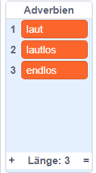

## Mehr Poesie

Your poem is quite short - let's add to it!

\--- task \---

Lass uns Adverbien in der nächsten Gedichtszeile benutzen. Ein **Adverb** ist ein Wort, welches ein Verb beschreibt. Erstelle eine weitere Liste namens Adverbien und füge diese 3 Wörter hinzu:



\--- /task \---

\--- task \---

Füge diese Zeile zu deinem Computer Code hinzu, um ein zufälliges Adverb auf der nächsten Gedichtszeile zu sagen:


```blocks3
when this sprite clicked
say [Here is your poem...] for (2) seconds
say (join [I ](item (pick random (1) to (length of [verbs v])) of [verbs v])) for (2) seconds
+say (item (pick random (1) to (length of [adverbs v])) of [adverbs v]) for (2) seconds
```

\--- /task \---

\--- task \---

Teste deinen Code mehrmals. Du solltest jedes Mal ein zufälliges Gedicht sehen.


\--- /task \---

\--- task \---

Füge eine Liste mit Nomen zu deinem Projekt hinzu. Ein **Nomen** ist ein Ort oder Gegenstand.


\--- /task \---

\--- task \---

Füge einen Code hinzu, um die Nomen in deinen Gedicht zu benutzen.


```blocks3
when this sprite clicked
say [Here is your poem...] for (2) seconds
say (join [I ](item (pick random (1) to (length of [verbs v])) of [verbs v])) for (2) seconds
say (item (pick random (1) to (length of [adverbs v])) of [adverbs v]) for (2) seconds
+say (join [by the ](item (pick random (1) to (length of [nouns v])) of [nouns v])) for (2) seconds
```

\--- /task \---

\--- task \---

Füge eine Liste mit Adjektiven zu deinem Projekt hinzu. Ein **Adjektiv** ist ein Wort zum Umschreiben.


\--- /task \---

\--- task \---

Füge einen Code zu deinen Gedicht hinzu, um Adjektive zu benutzen:


```blocks3
when this sprite clicked
say [Here is your poem...] for (2) seconds
say (join [I ](item (pick random (1) to (length of [verbs v])) of [verbs v])) for (2) seconds
say (item (pick random (1) to (length of [adverbs v])) of [adverbs v]) for (2) seconds
say (join [by the ](item (pick random (1) to (length of [nouns v])) of [nouns v])) for (2) seconds
+ say (join [I feel ](item (pick random (1) to (length of [adjectives v])) of [adjectives v])) for (2) seconds
```

\--- /task \---

\--- task \---

You can click the boxes next to your lists to hide them.


\--- /task \---

\--- task \---

Test out your new poem.

\--- /task \---