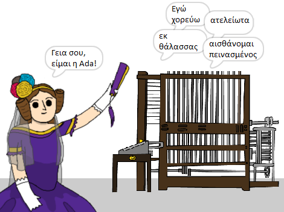

\--- no-print \---

Αυτή είναι η έκδοση **Scratch 3** του έργου. Υπάρχει επίσης η [έκδοση Scratch 2 του έργου](https://projects.raspberrypi.org/en/projects/poetry-generator-scratch2).

\--- /no-print \---

## Εισαγωγή

Θα μάθεις πώς να προγραμματίσεις τη δική σου γεννήτρια ποίησης!

\--- no-print \---

  <iframe allowtransparency="true" width="485" height="402" src="https://scratch.mit.edu/projects/embed/77844926/?autostart=false" frameborder="0" scrolling="no"></iframe>
  

\--- /no-print \---

\--- print-only \---

\--- /print-only \---

## \--- collapse \---

## title: Τι θα μάθεις

+ Μεταβλητές
+ Λίστες και στοιχεία τυχαίας λίστας
+ Επανάληψη (μπλοκ `επαναλήψεων`{:class="block3control"})

\--- /collapse \---

## \--- collapse \---

## title: Τι θα χρειαστείς

#### Υλικό

+ Ένας υπολογιστής ικανός να τρέχει το Scratch 3

#### Λογισμικό

+ Scratch 3 (είτε [online](http://rpf.io/scratchon){:target="_blank"} είτε [offline](http://rpf.io/scratchoff){:target="_blank"})

#### Λήψεις

Το αρχικό project μπορεί να βρεθεί [εδώ](http://rpf.io/p/en/poetry-generator-go){:target="_blank"}.

\--- /collapse \---

## \--- collapse \---

## title: Πρόσθετες πληροφορίες για εκπαιδευτικούς

Το έργο αυτό έχει δημιουργηθεί για τη γιορτή της [Ημέρας Ada Lovelace](https://findingada.com). Εάν είσαι δάσκαλος, μπορείς να κατεβάσεις ένα πακέτο σχολικού υλικού το οποίο περιέχει επίσης ένα σχέδιο συναρμολόγησης ([downloads.codeclub.org.uk/ada.zip](http://downloads.codeclub.org.uk/ada.zip)), για να εισαγάγει τα παιδιά στην Ada και τις επαναστατικές ιδέες της.

\--- no-print \---

Αν χρειαστεί να εκτυπώσεις αυτό το έργο, χρησιμοποίησε την [εκτυπώσιμη έκδοση](https://projects.raspberrypi.org/en/projects/poetry-generator/print)"{:target="_blank"}.

\--- /no-print \---

Μπορείς να βρεις το [ολοκληρωμένο έργο εδώ](http://rpf.io/p/en/poetry-generator-get){:target="_blank"}.

\--- /collapse \---