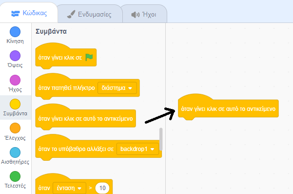
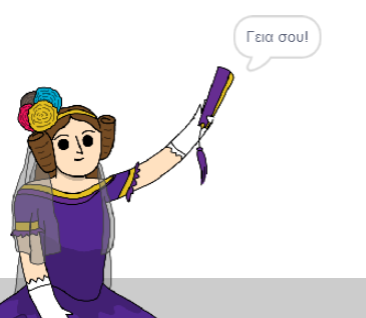

## Ada Lovelace

Το 1842, η Ada Lovelace έγραψε για τη χρήση μιας μηχανής που ονομάζεται «Αναλυτική Μηχανή» για να κάνει υπολογισμούς και θεωρείται η πρώτη προγραμματιστής στον κόσμο! Η Ada ήταν επίσης η πρώτη που είδε ότι οι υπολογιστές θα μπορούσαν να είναι κάτι περισσότερο από απλά μεγάλες αριθμομηχανές.

\--- task \---

Άνοιξε το πρόγραμμα εκκίνησης Scratch 'Γεννήτρια Ποίησης'.

**Online**: άνοιξε το [αρχικό έργο](http://rpf.io/poetry-on){:target="_ blank"}.

If you have a Scratch account you can make a copy by clicking **Remix**.

**Offline**: open the [starter project](http://rpf.io/p/en/beat-the-goalie-go){:target="_blank"} in the offline editor.

If you need to download and install the Scratch offline editor, you can find it at [rpf.io/scratchoff](http://rpf.io/scratchoff){:target="_blank"}.

\--- /task \---

\--- task \---

Click on your 'Ada' sprite, and click the `Events`{:class="block3events"} tab in the 'Scripts' coding section. Drag the `when this sprite clicked`{:class="block3events"} block onto the coding area on the right.




Any code added underneath this block will run when Ada is clicked!

\--- /task \---

\--- task \---

Click the `Looks`{:class="block3looks"} tab, and drag the `say`{:class="block3looks"} `Hello!` `for 2 secs`{:class="block3looks"} block underneath the `when this sprite clicked`{:class="block3events"} block you've already added.


```blocks3
when this sprite clicked
say [Hello!] for (2) seconds
```

\--- /task \---

\--- task \---

Click on Ada, and you should see her talk to you.



\--- /task \---