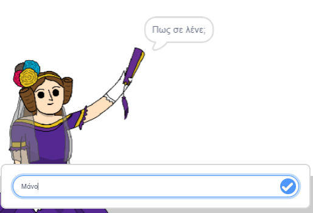
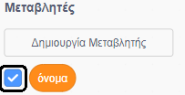
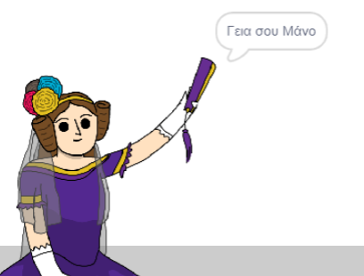

## Πες στην Ada το όνομά σου

Η Ada παρουσίασε τον εαυτό της, αλλά δεν ξέρει το όνομά σου!

--- task ---

Σύρε ένα μπλοκ `ρώτησε`{:class="block3sensing"} (από την ενότητα `αισθητήρες`{:class="block3sensing"}) στον κώδικά σου. Έτσι πρέπει να φαίνεται ο κώδικάς σου:


```blocks3
when this sprite clicked
say [Γεια σου, είμαι η Ada!] for (2) seconds
+ ask [Πώς σε λένε;] and wait
```

--- /task ---

--- task ---

Κάνε κλικ στην Ada για να ελέγξεις τον κώδικά σου. Η Ada θα σε ρωτήσει το όνομά σου, το οποίο μπορείς να πληκτρολογήσεις!



--- /task ---

--- task ---

Μπορούμε να χρησιμοποιήσουμε μια **μεταβλητή** για να αποθηκεύσουμε το όνομά σου. Κάνε κλικ στο στοιχείο `Μεταβλητές`{:class="block3variables"} και, στη συνέχεια, "Δημιουργία Μεταβλητής". Δεδομένου ότι αυτή η μεταβλητή θα χρησιμοποιηθεί για την αποθήκευση του ονόματός σου, ας καλέσουμε τη μεταβλητή... `όνομα`{:class="block3variables"}!

[[[generic-scratch3-add-variable]]]

--- /task ---

--- task ---

Για να αποθηκεύσεις το όνομά σου, κάνε κλικ στην καρτέλα `Μεταβλητές`{:class="block3variables"} και, στη συνέχεια, σύρε το μπλοκ `όρισε όνομα`{:class="block3variables"} στο τέλος του κώδικά σου.


```blocks3
when this sprite clicked
say [Γεια σου, είμαι η Ada!] for (2) seconds
ask [Πώς σε λένε;] and wait
+ set [όνομα v] to [0]
```

--- /task ---

--- task ---

Χρησιμοποίησε το μπλοκ `απάντηση`{:class="block3sensing"} για να αποθηκεύσεις την απάντηση που πληκτρολογείς.


```blocks3
when this sprite clicked
say [Γεια σου, είμαι η Ada!] for (2) seconds
ask [Πώς σε λένε;] and wait
set [όνομα v] to (answer :: +)
```

--- /task ---

--- task ---

Κάνε κλικ στην Ada για να ελέγξεις τον κώδικά σου και συμπλήρωσε το όνομά σου όταν ζητηθεί. Θα δεις ότι το όνομά σου έχει αποθηκευτεί στη μεταβλητή `όνομα`{:class="block3variables"}.


--- /task ---

--- task ---

Τώρα μπορείς να χρησιμοποιήσεις το όνομά σου στον κώδικά σου. Πρόσθεσε αυτόν τον κώδικα:


```blocks3
when this sprite clicked
say [Γεια σου, είμαι η Ada!] for (2) seconds
ask [Πώς σε λένε;] and wait
set [όνομα v] to (answer)
+say (join [Γεια σου ] (όνομα)) for (2) seconds 
```

Για να δημιουργήσεις αυτόν τον κώδικα:

1. Σύρε ένα μπλοκ `ένωσε`{:class="blockoperators"} στο μπλοκ `πες`{:class="blocklooks"}
    
    ```blocks3
    say (join [apple] [banana] :: +) for (2) seconds
    ```

2. Πρόσθεσε το μπλοκ `όνομα`{:class="blockdata"} στο μπλοκ `ένωσε`{:class="blockoperators"}.
    
    ```blocks3
    say (join [Γεια σου ] (όνομα :: variables +)) for (2) seconds
    ```

--- /task ---

--- task ---

Για να αποκρύψεις τη μεταβλητή `όνομα`{:class="block3variables"} στη σκηνή, κάνε κλικ στην επιλογή που βρίσκεται δίπλα στη μεταβλητή.



--- /task ---

--- task ---

Δοκίμασε τον νέο σου κώδικα. Η Ada θα σε χαιρετήσει, χρησιμοποιώντας το όνομά σου!



Εάν δεν υπάρχει κενό ανάμεσα στις λέξεις «Γεια σου» και το όνομά σου, θα πρέπει να προσθέσεις ένα κενό στον κώδικα!

--- /task ---

--- task ---

Τέλος, πρόσθεσε αυτόν τον κώδικα για να εξηγήσεις τι πρέπει να κάνεις στη συνέχεια:


```blocks3
when this sprite clicked
say [Γεια σου, είμαι η Ada!] for (2) seconds
ask [Πώς σε λένε;] and wait
set [όνομα v] to (answer)
say (join [Hi ] (όνομα)) for (2) seconds 
+ say [Click the computer to generate a poem.] for (2) seconds 
```

--- /task ---

--- task ---

Δοκίμασε τον κώδικα της Ada για τελευταία φορά, για να βεβαιωθείς ότι όλα λειτουργούν σωστά.

--- /task ---