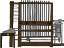

## Η Αναλυτική Μηχανή

Ας προγραμματίσουμε τον υπολογιστή της Ada (που ονομάζεται 'Αναλυτική Μηχανή') για να δημιουργήσουμε ποίηση.

\--- task \---

Πρόσθεσε αυτόν τον κώδικα στο αντικείμενο 'Υπολογιστής', έτσι ώστε να μιλάει όταν κάνεις κλικ:



```blocks3
when this sprite clicked
say [Here is your poem...] for (2) seconds
```

\--- /task \---

\--- task \---

Για να δημιουργήσεις ένα τυχαίο ποίημα, πρώτα θα χρειαστείς μια **λίστα** των λέξεων που πρέπει να χρησιμοποιηθούν. To create a new list, click the `Variables`{:class="block3variables"} tab.

Ας χρησιμοποιήσουμε τα **ρήματα** (λέξεις δράσης) στην πρώτη γραμμή του ποιήματός σου. Δημιούργησε μια λίστα που ονομάζεται `ρήματα`{:class="block3variables"}.

[[[generic-scratch3-make-list]]]

\--- /task \---

\--- task \---

Η νέα σου λίστα θα είναι κενή. Κάνε κλικ στο `+` στο κάτω μέρος της κενής σου λίστας και πρόσθεσε αυτά τα ρήματα:


\--- /task \---

\--- task \---

Η πρώτη γραμμή του ποιήματος σου πρέπει να είναι η λέξη "Εγώ", ακολουθούμενη από ένα τυχαίο ρήμα.

Για να δημιουργήσεις αυτή τη γραμμή ποίησης, πρέπει να:

1. `Επίλεξε ένα τυχαίο αριθμό`{:class="block3operators"} ανάμεσα στο `1` και το `μήκος της λίστας των ρημάτων`{:class="block3variables"}:
    
    ```blocks3
    (pick random (1) to (length of [verbs v]))
    ```

2. Χρησιμοποίησε αυτό το μπλοκ για να πάρεις ένα τυχαίο `αντικείμενο`{:class="block3variables"} από τη λίστα `ρημάτων`{:class="block3variables"}:
    
    ```blocks3
    (item (pick random (1) to (length of [verbs v]) :: +) of [verbs v])
    ```

3. `Ένωσε`{:class="block3operators"} το "Εγώ" με το τυχαίο ρήμα για να δημιουργήσεις τη πρώτη γραμμή του ποιήματός σου:
    
    ```blocks3
    (join [I ] (item (pick random (1) to (length of [verbs v])) of [verbs v] :: +))
    ```

4. Χρησιμοποίησε ένα μπλοκ `πες`{:class="block3looks"} για να εμφανίσεις τη γραμμή του ποιήματός σου:
    
    ```blocks3
    say (join [I ](item (pick random (1) to (length of [verbs v])) of [verbs v]) :: +) for (2) seconds
    ```

Ο κώδικάς σου θα πρέπει να μοιάζει κάπως έτσι:


```blocks3
when this sprite clicked
say [Here is your poem...] for (2) seconds
+ say (join [I ](item (pick random (1) to (length of [verbs v])) of [verbs v])) for (2) seconds
```

\--- /task \---

\--- task \---

Δοκίμασε τον κώδικά σου μερικές φορές. Ο υπολογιστής σου θα πρέπει να επιλέξει μία τυχαία λέξη από τη λίστα με τα `ρήματα`{:class="block3variables"} κάθε φορά.


\--- /task \---