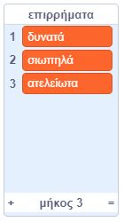
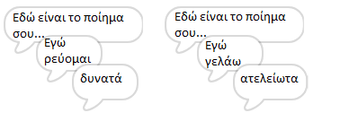
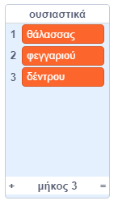
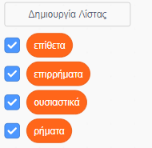

## Περισσότερη ποίηση

Το ποίημά σου είναι αρκετά σύντομο - ας το μεγαλώσουμε!

--- task ---

Ας χρησιμοποιήσουμε επιρρήματα στην επόμενη γραμμή του ποιήματός σου. Ένα **επίρρημα** είναι μια λέξη που περιγράφει ένα ρήμα. Δημιούργησε ακόμη μια λίστα που ονομάζεται επιρρήματα και πρόσθεσε αυτές τις 3 λέξεις:



--- /task ---

--- task ---

Πρόσθεσε αυτήν τη γραμμή στον κώδικα του υπολογιστή σου, για να δηλώσεις ένα τυχαίο επίρρημα στην επόμενη γραμμή του ποιήματός σου:


```blocks3
when this sprite clicked
say [Εδώ είναι το ποίημα σου…] for (2) seconds
say (join [Εγώ ](item (pick random (1) to (length of [ρήματα v])) of [ρήματα v])) for (2) seconds
+say (item (pick random (1) to (length of [επιρρήματα v])) of [επιρρήματα v]) for (2) seconds
```

--- /task ---

--- task ---

Δοκίμασε τον κώδικά σου μερικές φορές. Θα πρέπει να δεις ένα τυχαίο ποίημα κάθε φορά.



--- /task ---

--- task ---

Πρόσθεσε μια λίστα με ουσιαστικά στο έργο σου. Ένα **ουσιαστικό** είναι μια τοποθεσία ή ένα αντικείμενο.



--- /task ---

--- task ---

Πρόσθεσε κώδικα για να χρησιμοποιήσεις τα ουσιαστικά στο ποίημά σου.


```blocks3
when this sprite clicked
say [Εδώ είναι το ποίημα σου…] for (2) seconds
say (join [Εγώ ](item (pick random (1) to (length of [ρήματα v])) of [ρήματα v])) for (2) seconds
say (item (pick random (1) to (length of [επιρρήματα v])) of [επιρρήματα v]) for (2) seconds
+say (join [εκ ](item (pick random (1) to (length of [ουσιαστικά v])) of [ουσιαστικά v])) for (2) seconds
```

--- /task ---

--- task ---

Πρόσθεσε μια λίστα με επίθετα στο έργο σου. Ένα **επίθετο** είναι μια λέξη που περιγράφει ένα ουσιαστικό.


--- /task ---

--- task ---

Πρόσθεσε κώδικα για να χρησιμοποιήσεις τα επίθετα στο ποίημά σου:


```blocks3
when this sprite clicked
say [Εδώ είναι το ποίημα σου…] for (2) seconds
say (join [Εγώ ](item (pick random (1) to (length of [ρήματα v])) of [ρήματα v])) for (2) seconds
say (item (pick random (1) to (length of [επιρρήματα v])) of [επιρρήματα v]) for (2) seconds
say (join [εκ ](item (pick random (1) to (length of [ουσιαστικά v])) of [ουσιαστικά v])) for (2) seconds
+ say (join [Αισθάνομαι ](item (pick random (1) to (length of [επίθετα v])) of [επίθετα v])) for (2) seconds
```

--- /task ---

--- task ---

Μπορείς να κάνεις κλικ στα πλαίσια δίπλα στις λίστες σου για να τα αποκρύψεις.



--- /task ---

--- task ---

Δοκίμασε το νέο σου ποίημα.

--- /task ---