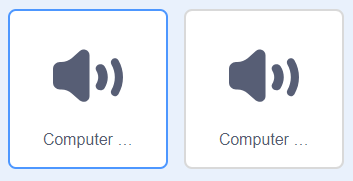

## Ενεργοποιώντας την Αναλυτική Μηχανή

Ας ενεργοποιήσουμε τον υπολογιστή σου, έτσι ώστε να φαίνεται σαν να δημιουργεί ποίηση.

\--- task \---

Κάνε κλικ στο αντικείμενο του υπολογιστή σου και πρόσθεσε αυτόν τον κώδικα μετά από το πρώτο μπλοκ `πες`{:class="block3looks"}:

Θα βρεις ότι τα μπλοκ `επανέλαβε`{:class="block3control"} και `περίμενε`{:class="block3control"} βρίσκονται στην ενότητα `Έλεγχος`{:class="block3control"}.


```blocks3
when this sprite clicked
say [Here is your poem...] for (2) seconds
+ repeat (10)
    turn left (5) degrees
    wait (0.1) seconds
    turn right (5) degrees
    wait (0.1) seconds  
end
say (join [I ](item (pick random (1) to (length of [verbs v])) of [verbs v])) for (2) seconds
say (item (pick random (1) to (length of [adverbs v])) of [adverbs v]) for (2) seconds
say (join [by the ](item (pick random (1) to (length of [nouns v])) of [nouns v])) for (2) seconds
say (join [I feel ](item (pick random (1) to (length of [adjectives v])) of [adjectives v])) for (2) seconds
```

\--- /task \---

\--- task \---

Δοκίμασε το έργο σου. Θα πρέπει να δεις τον υπολογιστή να κουνιέται πριν παράγει ένα ποίημα!


\--- /task \---

\--- task \---

Κάνε κλικ στην καρτέλα 'Ήχοι' και κάνε κλικ στο εικονίδιο 'Επιλογή ήχου' στο κάτω αριστερό μέρος.

[[[generic-scratch3-sound-from-library]]]

\--- /task \---

\--- task \---

Επίλεξε έναν ήχο "μπιπ υπολογιστή" και πάτησε ΟΚ.



\--- /task \---

\--- task \---

Πρόσθεσε ένα μπλοκ `παίξε ήχο`{:class="block3sound"}, για να παίξεις τον ήχο πριν ξεκινήσει η κίνηση.


```blocks3
when this sprite clicked
say [Here is your poem...] for (2) seconds
+ start sound (computer beeps1 v)
repeat (10)
    turn left (5) degrees
    wait (0.1) seconds
    turn right (5) degrees
    wait (0.1) seconds  
end
say (join [I ](item (pick random (1) to (length of [verbs v])) of [verbs v])) for (2) seconds
say (item (pick random (1) to (length of [adverbs v])) of [adverbs v]) for (2) seconds
say (join [by the ](item (pick random (1) to (length of [nouns v])) of [nouns v])) for (2) seconds
say (join [I feel ](item (pick random (1) to (length of [adjectives v])) of [adjectives v])) for (2) seconds
```

\--- /task \---