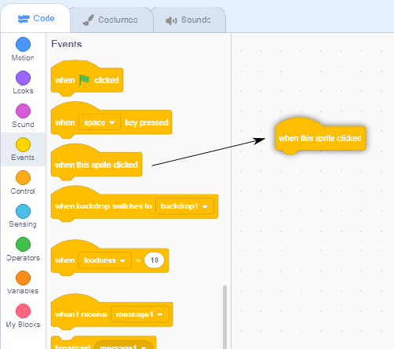

## Ada Lovelace

In 1842, Ada Lovelace wrote about using a machine called the 'Analytical Engine' to make calculations, and is seen as the world's first computer programmer! Ada was also the first to see that computers could be more than just big calculators.

--- task ---

Open the 'Poetry Generator' Scratch starter project.

**Online**: open the [starter project](http://rpf.io/poetry-on){:target="_blank"}.

**Offline**: open the [starter project](http://rpf.io/p/en/beat-the-goalie-go){:target="_blank"} in the offline editor.

If you need to download and install the Scratch offline editor, you can find it at [rpf.io/scratchoff](http://rpf.io/scratchoff){:target="_blank"}.

--- /task ---

--- task ---

Click on your 'Ada' sprite, and click the `Events`{:class="blockevents"} tab in the 'Scripts' coding section. Drag the `when this sprite clicked`{:class="blockevents"} block onto the coding area on the right.




Any code added underneath this block will run when Ada is clicked!

--- /task ---

--- task ---

Click the `Looks`{:class="blocklooks"} tab, and drag the `say`{:class="blocklooks"} `Hello!` `for 2 secs`{:class="blocklooks"} block underneath the `when this sprite clicked`{:class="blockevents"} block you've already added.


```blocks
when this sprite clicked
say [Hello!] for (2) secs
```

--- /task ---

--- task ---

Click on Ada, and you should see her talk to you.


--- /task ---
