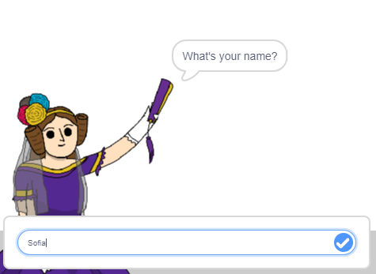
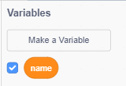
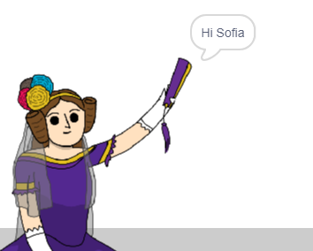

## Telling Ada your name

Ada has introduced herself, but she doesn't know your name!

--- task ---

Drag an `ask`{:class="blocksensing"} block (from the `sensing`{:class="blocksensing"} section) onto your code. Here's how your code should look:


```blocks
when this sprite clicked
say [Hi, I'm Ada!] for (2) secs
+ ask [What's your name?] and wait
```

--- /task ---

--- task ---

Click on Ada to test your code. Ada should ask you your name, which you can type in!



--- /task ---

--- task ---

We can use a __variable__ to store your name. Click `Data`{:class="blockdata"}, and then 'Make a Variable'. As this variable will be used to store your name, let's call the variable... `name`{:class="blockdata"}!


--- /task ---

--- task ---

To store your name, click the `Data`{:class="blockdata"} tab, and then drag the `set name`{:class="blockdata"} block onto the end of your code.


```blocks
when this sprite clicked
say [Hi, I'm Ada!] for (2) secs
ask [What's your name?] and wait
+ set [name v] to [0]
```

--- /task ---

--- task ---

Use the `answer`{:class="blocksensing"} block to store the answer you type in.


```blocks
when this sprite clicked
say [Hi, I'm Ada!] for (2) secs
ask [What's your name?] and wait
set [name v] to (answer :: +)
```

--- /task ---

--- task ---

Click on Ada to test your code, and enter your name when asked. You should see that your name has been stored in the `name`{:class="blockdata"} variable.


--- /task ---

--- task ---

You can now make use of your name in your code. Add this code:


```blocks
when this sprite clicked
say [Hi, I'm Ada!] for (2) secs
ask [What's your name?] and wait
set [name v] to (answer)
+say (join [Hi ] (name)) for (2) secs 
```

To create this code, first drag a `join`{:class="blockoperators"} block onto the `say`{:class="blocklooks"} block, and then add your `name`{:class="blockdata"} block onto the `join`{:class="blockoperators"} block.


--- /task ---

--- task ---

To hide your `name`{:class="blockdata"} variable on the stage, click the tick next to the variable.



--- /task ---

--- task ---

Test your new code. Ada should say hello to you, using your name!



If there's no space between the word 'Hi' and your name, you'll need to add a space into the code yourself!

--- /task ---

--- task ---

Finally, add this code to explain what to do next:


```blocks
when this sprite clicked
say [Hi, I'm Ada!] for (2) secs
ask [What's your name?] and wait
set [name v] to (answer)
say (join [Hi ] (name)) for (2) secs 
+ say [Click the computer to generate a poem.] for (2) secs 
```

--- /task ---

--- task ---

Test Ada's code one last time, to make sure that everything works. 

--- /task ---
